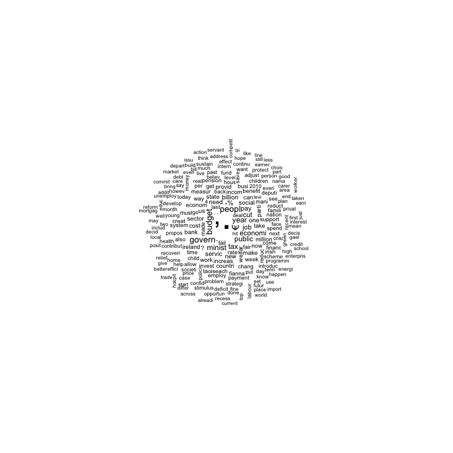

Preliminaries: Installation
---------------------------

First, you need to have **quanteda** installed. You can do this from
inside RStudio, from the Tools…Install Packages menu, or simply using

``` r
install.packages("quanteda")
```

(Optional) You can install some additional corpus data from
**quantedaData** using

``` r
## the devtools package is required to install quanteda from Github
devtools::install_github("kbenoit/quantedaData")
```

Test your setup
---------------

Run the rest of this file to test your setup. You must have quanteda
installed in order for this next step to succeed.

``` r
library("quanteda")
```

    ## quanteda version 0.99.22

    ## Using 7 of 8 threads for parallel computing

    ## 
    ## Attaching package: 'quanteda'

    ## The following object is masked from 'package:utils':
    ## 
    ##     View

Now summarize some texts in the Irish 2010 budget speech corpus:

``` r
summary(data_corpus_irishbudget2010)
```

    ## Corpus consisting of 14 documents:
    ## 
    ##                                   Text Types Tokens Sentences year debate
    ##        2010_BUDGET_01_Brian_Lenihan_FF  1953   8641       374 2010 BUDGET
    ##       2010_BUDGET_02_Richard_Bruton_FG  1040   4446       217 2010 BUDGET
    ##         2010_BUDGET_03_Joan_Burton_LAB  1624   6393       307 2010 BUDGET
    ##        2010_BUDGET_04_Arthur_Morgan_SF  1595   7107       343 2010 BUDGET
    ##          2010_BUDGET_05_Brian_Cowen_FF  1629   6599       250 2010 BUDGET
    ##           2010_BUDGET_06_Enda_Kenny_FG  1148   4232       153 2010 BUDGET
    ##      2010_BUDGET_07_Kieran_ODonnell_FG   678   2297       133 2010 BUDGET
    ##       2010_BUDGET_08_Eamon_Gilmore_LAB  1181   4177       201 2010 BUDGET
    ##     2010_BUDGET_09_Michael_Higgins_LAB   488   1286        44 2010 BUDGET
    ##        2010_BUDGET_10_Ruairi_Quinn_LAB   439   1284        59 2010 BUDGET
    ##      2010_BUDGET_11_John_Gormley_Green   401   1030        49 2010 BUDGET
    ##        2010_BUDGET_12_Eamon_Ryan_Green   510   1643        90 2010 BUDGET
    ##      2010_BUDGET_13_Ciaran_Cuffe_Green   442   1240        45 2010 BUDGET
    ##  2010_BUDGET_14_Caoimhghin_OCaolain_SF  1188   4044       176 2010 BUDGET
    ##  number      foren     name party
    ##      01      Brian  Lenihan    FF
    ##      02    Richard   Bruton    FG
    ##      03       Joan   Burton   LAB
    ##      04     Arthur   Morgan    SF
    ##      05      Brian    Cowen    FF
    ##      06       Enda    Kenny    FG
    ##      07     Kieran ODonnell    FG
    ##      08      Eamon  Gilmore   LAB
    ##      09    Michael  Higgins   LAB
    ##      10     Ruairi    Quinn   LAB
    ##      11       John  Gormley Green
    ##      12      Eamon     Ryan Green
    ##      13     Ciaran    Cuffe Green
    ##      14 Caoimhghin OCaolain    SF
    ## 
    ## Source:  /Users/kbenoit/Dropbox (Personal)/GitHub/quanteda/* on x86_64 by kbenoit
    ## Created: Wed Jun 28 22:04:18 2017
    ## Notes:

Create a document-feature matrix from this corpus, removing stop words:

``` r
ie_dfm <- dfm(data_corpus_irishbudget2010, remove = c(stopwords("english"), "will"), stem = TRUE)
```

Look at the top occuring features:

``` r
topfeatures(ie_dfm)
```

    ##      .      ,      €  peopl budget govern minist   year    tax public 
    ##   2371   1548    336    273    272    271    204    201    195    179

Make a word cloud:

``` r
dfm_remove(ie_dfm, "\\p{Z}", valuetype = "regex") %>%
  textplot_wordcloud(min.freq = 25, random.order = FALSE)
```



If you got this far, congratulations!

Three ways to create a `corpus` object
--------------------------------------

**quanteda can construct a `corpus` object** from several input sources:

1.  a character vector object

    ``` r
    my_tiny_corpus <- corpus(data_corpus_inaugural[1:2], metacorpus = list(notes = "Just G.W."))
    summary(my_tiny_corpus)
    ```

        ## Corpus consisting of 2 documents:
        ## 
        ##             Text Types Tokens Sentences
        ##  1789-Washington   625   1538        23
        ##  1793-Washington    96    147         4
        ## 
        ## Source:  /Users/kbenoit/Dropbox (Personal)/GitHub/QTAUR-halfday/1_getting_started/* on x86_64 by kbenoit
        ## Created: Wed Nov 15 09:11:28 2017
        ## Notes:   Just G.W.

2.  a `VCorpus` object from the **tm** package, and

    ``` r
    data(crude, package = "tm")
    my_tm_corpus <- corpus(crude)
    ```

        ## Warning in format.POSIXlt(x, ...): unknown timezone 'default/Europe/London'

    ``` r
    summary(my_tm_corpus, 5)
    ```

        ## Corpus consisting of 20 documents, showing 5 documents:
        ## 
        ##  Text Types Tokens Sentences       datetimestamp description
        ##   127    62    103         5 1987-02-26 17:00:56            
        ##   144   238    495        19 1987-02-26 17:34:11            
        ##   191    47     62         4 1987-02-26 18:18:00            
        ##   194    55     74         5 1987-02-26 18:21:01            
        ##   211    67     97         4 1987-02-26 19:00:57            
        ##                                          heading  id language
        ##         DIAMOND SHAMROCK (DIA) CUTS CRUDE PRICES 127       en
        ##  OPEC MAY HAVE TO MEET TO FIRM PRICES - ANALYSTS 144       en
        ##        TEXACO CANADA <TXC> LOWERS CRUDE POSTINGS 191       en
        ##        MARATHON PETROLEUM REDUCES CRUDE POSTINGS 194       en
        ##        HOUSTON OIL <HO> RESERVES STUDY COMPLETED 211       en
        ##             origin topics lewissplit     cgisplit oldid places
        ##  Reuters-21578 XML    YES      TRAIN TRAINING-SET  5670    usa
        ##  Reuters-21578 XML    YES      TRAIN TRAINING-SET  5687    usa
        ##  Reuters-21578 XML    YES      TRAIN TRAINING-SET  5734 canada
        ##  Reuters-21578 XML    YES      TRAIN TRAINING-SET  5737    usa
        ##  Reuters-21578 XML    YES      TRAIN TRAINING-SET  5754    usa
        ##                      author orgs people exchanges
        ##                        <NA> <NA>   <NA>      <NA>
        ##  BY TED D'AFFLISIO, Reuters opec   <NA>      <NA>
        ##                        <NA> <NA>   <NA>      <NA>
        ##                        <NA> <NA>   <NA>      <NA>
        ##                        <NA> <NA>   <NA>      <NA>
        ## 
        ## Source:  Converted from tm Corpus 'crude'
        ## Created: Wed Nov 15 09:11:28 2017
        ## Notes:

3.  a `readtext` object, created by `readtext::readtext()`.

    In most cases you will need to load input files from outside of R,
    so you will use this third method. The remainder of this tutorial
    focuses on `textfile()`, which is designed to be a simple, powerful,
    and all-purpose method to load texts.

Using **readtext** to import texts
----------------------------------

In the simplest case, we would like to load a set of texts in plain text
files from a single directory. To do this, we use the `readtext()`
function from the **readtext** package, and use the “glob”" operator `*`
to indicate that we want to load multiple files:

``` r
library("readtext")
readtext("inaugural/*.txt") %>% corpus()
```

    ## Corpus consisting of 57 documents and 1 docvar.

``` r
readtext("sotu/*.txt") %>% corpus()
```

    ## Corpus consisting of 229 documents and 1 docvar.

Often, we have metadata encoded in the names of the files. For example,
the inaugural addresses contain the year and the president’s name in the
name of the file. With the `docvarsfrom` argument, we can instruct the
`textfile` command to consider these elements as document variables.

``` r
mytf <- readtext("inaugural/*.txt", 
                 docvarsfrom = "filenames", dvsep = "-", docvarnames = c("Year", "President"))
inaug_corpus <- corpus(mytf)
summary(inaug_corpus, 5)
```

    ## Corpus consisting of 57 documents, showing 5 documents:
    ## 
    ##   Text Types Tokens Sentences              doc_id Year  President
    ##  text1   625   1538        23 1789-Washington.txt 1789 Washington
    ##  text2    96    147         4 1793-Washington.txt 1793 Washington
    ##  text3   826   2578        37      1797-Adams.txt 1797      Adams
    ##  text4   717   1927        41  1801-Jefferson.txt 1801  Jefferson
    ##  text5   804   2381        45  1805-Jefferson.txt 1805  Jefferson
    ## 
    ## Source:  /Users/kbenoit/Dropbox (Personal)/GitHub/QTAUR-halfday/1_getting_started/* on x86_64 by kbenoit
    ## Created: Wed Nov 15 09:11:30 2017
    ## Notes:

If the texts and document variables are stored separately, we can easily
add document variables to the corpus, as long as the data frame
containing them is of the same length as the texts:

``` r
SOTUdocvars <- read.csv("SOTU_metadata.csv", stringsAsFactors = FALSE)
SOTUdocvars$Date <- as.Date(SOTUdocvars$Date, "%B %d, %Y")
SOTUdocvars$delivery <- as.factor(SOTUdocvars$delivery)
SOTUdocvars$type <- as.factor(SOTUdocvars$type)
SOTUdocvars$party <- as.factor(SOTUdocvars$party)
SOTUdocvars$nwords <- NULL

sotu_corpus <- readtext("sotu/*.txt", encoding = "UTF-8-BOM") %>% corpus()
docvars(sotu_corpus) <- SOTUdocvars
summary(sotu_corpus, 5)
```

    ## Corpus consisting of 229 documents, showing 5 documents:
    ## 
    ##   Text Types Tokens Sentences      doc_id FirstName  President       Date
    ##  text1   591   1501        38  su1790.txt    George Washington 1790-01-08
    ##  text2   460   1167        24 su1790b.txt    George Washington 1790-12-08
    ##  text3   814   2471        58  su1791.txt    George Washington 1791-10-25
    ##  text4   769   2282        59  su1792.txt    George Washington 1792-11-06
    ##  text5   800   2116        54  su1793.txt    George Washington 1793-12-03
    ##  delivery type    filename       party
    ##    spoken SOTU  su1790.txt Independent
    ##    spoken SOTU su1790b.txt Independent
    ##    spoken SOTU  su1791.txt Independent
    ##    spoken SOTU  su1792.txt Independent
    ##    spoken SOTU  su1793.txt Independent
    ## 
    ## Source:  /Users/kbenoit/Dropbox (Personal)/GitHub/QTAUR-halfday/1_getting_started/* on x86_64 by kbenoit
    ## Created: Wed Nov 15 09:11:32 2017
    ## Notes:

Another common case is that our texts are stored alongside the document
variables in a structured file, such as a json, csv or excel file. The
textfile command can read in the texts and document variables
simultaneously from these files when the name of the field containing
the texts is specified.

``` r
tf1 <- readtext("inaugTexts.xls")
my_corpus <- corpus(tf1, text_field = "inaugSpeech")

tf2 <- readtext("text_example.csv", text_field = "Title")
my_corpus2 <- corpus(tf2)
head(docvars(tf2))  # works on readtext objects too
```

    ##   VOTE DocumentNo CouncilLink         Year Date.of.Meeting VotingDate
    ## 1    1    5728/99             Jan-Dec 1999      08/02/1999 08/02/1999
    ## 2    2    5728/99             Jan-Dec 1999      08/02/1999 08/02/1999
    ## 3    3    5728/99             Jan-Dec 1999      08/02/1999 08/02/1999
    ## 4    4    5728/99             Jan-Dec 1999      08/02/1999 08/02/1999
    ## 5    5    5728/99             Jan-Dec 1999      08/02/1999 08/02/1999
    ## 6    6    6327/99             Jan-Dec 1999      22/02/1999 22/02/1999
    ##                                       Policy.area Council.configuration
    ## 1 Employment, Education, Culture & Social Affairs                ECOFIN
    ## 2 Employment, Education, Culture & Social Affairs                ECOFIN
    ## 3 Employment, Education, Culture & Social Affairs                ECOFIN
    ## 4                         Agriculture & Fisheries                ECOFIN
    ## 5                  Transport & Telecommunications                ECOFIN
    ## 6                    Economic & Financial Affairs       General Affairs
    ##   Procedure
    ## 1      TRUE
    ## 2      TRUE
    ## 3     FALSE
    ## 4     FALSE
    ## 5     FALSE
    ## 6     FALSE

Once the we have loaded a corpus with some document level variables, we
can subset the corpus using these variables, create document-feature
matrices by aggregating on the variables, or extract the texts
concatenated by variable.

``` r
recentCorpus <- corpus_subset(sotu_corpus, Date >= "1980-01-01")
oldCorpus <- corpus_subset(sotu_corpus, Date < "1980-01-01")

demCorpus <- corpus_subset(sotu_corpus, party == "Democratic")
demFeatures <- dfm(demCorpus) %>%
  dfm_remove(stopwords("english")) %>%
  dfm_trim(min_docfreq = 3, min_count = 5) %>% 
  dfm_weight(type='tfidf') %>% 
  topfeatures()

repCorpus <- corpus_subset(sotu_corpus, party == "Republican") 
repFeatures <- dfm(repCorpus, remove = stopwords("english")) %>%
  dfm_trim(min_docfreq = 3, min_count = 5) %>% 
  dfm_weight(type='tfidf') %>% 
  topfeatures()
```

The `quanteda` corpus objects can be combined using the `+` operator:

``` r
inaugCorpus <- demCorpus + repCorpus
allFeatures <- dfm(inaugCorpus, remove = stopwords("english")) %>%
  dfm_trim(min_docfreq = 3, min_count = 5) %>% 
  dfm_weight(type = "tfidf") %>% 
  topfeatures()
```

It should also be possible to load a zip file containing texts directly
from a url. However, whether this operation succeeds or not can depend
on access permission settings on your particular system (i.e. fails on
Windows):

``` r
immigfiles <- readtext("https://github.com/kbenoit/ME114/raw/master/day8/UKimmigTexts.zip")
mycorpus <- corpus(immigfiles)
summary(mycorpus)
```

    ## Corpus consisting of 9 documents:
    ## 
    ##   Text Types Tokens Sentences           doc_id
    ##  text1  1125   3280        88          BNP.txt
    ##  text2   142    260         4    Coalition.txt
    ##  text3   251    499        15 Conservative.txt
    ##  text4   322    679        21       Greens.txt
    ##  text5   298    683        29       Labour.txt
    ##  text6   251    483        14       LibDem.txt
    ##  text7    77    114         5           PC.txt
    ##  text8    88    134         4          SNP.txt
    ##  text9   346    723        27         UKIP.txt
    ## 
    ## Source:  /Users/kbenoit/Dropbox (Personal)/GitHub/QTAUR-halfday/1_getting_started/* on x86_64 by kbenoit
    ## Created: Wed Nov 15 09:11:37 2017
    ## Notes:
