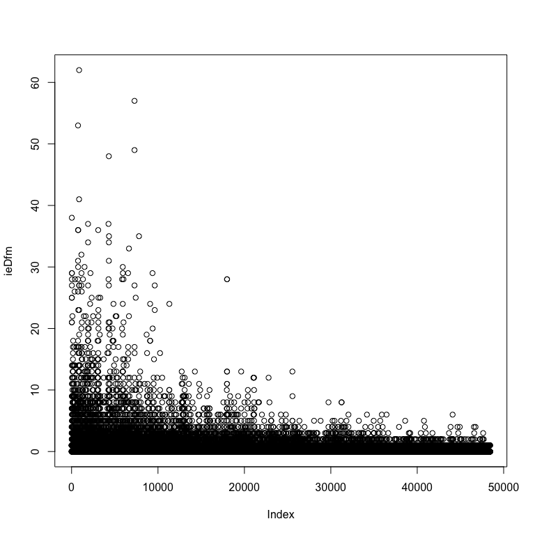

#### Preliminaries: Installation

First, you need to have **quanteda** installed. You can do this from
inside RStudio, from the Tools…Install Packages menu, or simply using

``` r
install.packages("quanteda")
```

(Optional) You can install some additional corpus data from
**quantedaData** using

``` r
## the devtools package is required to install quanteda from Github
devtools::install_github("kbenoit/quantedaData")
```

#### Test your setup

Run the rest of this file to test your setup. You must have quanteda
installed in order for this next step to succeed.

``` r
library("quanteda")
```

    ## quanteda version 0.99.22

    ## Using 7 of 8 threads for parallel computing

    ## 
    ## Attaching package: 'quanteda'

    ## The following object is masked from 'package:utils':
    ## 
    ##     View

Now summarize some texts in the Irish 2010 budget speech corpus:

``` r
summary(data_corpus_irishbudget2010)
```

    ## Corpus consisting of 14 documents:
    ## 
    ##                                   Text Types Tokens Sentences year debate
    ##        2010_BUDGET_01_Brian_Lenihan_FF  1953   8641       374 2010 BUDGET
    ##       2010_BUDGET_02_Richard_Bruton_FG  1040   4446       217 2010 BUDGET
    ##         2010_BUDGET_03_Joan_Burton_LAB  1624   6393       307 2010 BUDGET
    ##        2010_BUDGET_04_Arthur_Morgan_SF  1595   7107       343 2010 BUDGET
    ##          2010_BUDGET_05_Brian_Cowen_FF  1629   6599       250 2010 BUDGET
    ##           2010_BUDGET_06_Enda_Kenny_FG  1148   4232       153 2010 BUDGET
    ##      2010_BUDGET_07_Kieran_ODonnell_FG   678   2297       133 2010 BUDGET
    ##       2010_BUDGET_08_Eamon_Gilmore_LAB  1181   4177       201 2010 BUDGET
    ##     2010_BUDGET_09_Michael_Higgins_LAB   488   1286        44 2010 BUDGET
    ##        2010_BUDGET_10_Ruairi_Quinn_LAB   439   1284        59 2010 BUDGET
    ##      2010_BUDGET_11_John_Gormley_Green   401   1030        49 2010 BUDGET
    ##        2010_BUDGET_12_Eamon_Ryan_Green   510   1643        90 2010 BUDGET
    ##      2010_BUDGET_13_Ciaran_Cuffe_Green   442   1240        45 2010 BUDGET
    ##  2010_BUDGET_14_Caoimhghin_OCaolain_SF  1188   4044       176 2010 BUDGET
    ##  number      foren     name party
    ##      01      Brian  Lenihan    FF
    ##      02    Richard   Bruton    FG
    ##      03       Joan   Burton   LAB
    ##      04     Arthur   Morgan    SF
    ##      05      Brian    Cowen    FF
    ##      06       Enda    Kenny    FG
    ##      07     Kieran ODonnell    FG
    ##      08      Eamon  Gilmore   LAB
    ##      09    Michael  Higgins   LAB
    ##      10     Ruairi    Quinn   LAB
    ##      11       John  Gormley Green
    ##      12      Eamon     Ryan Green
    ##      13     Ciaran    Cuffe Green
    ##      14 Caoimhghin OCaolain    SF
    ## 
    ## Source:  /Users/kbenoit/Dropbox (Personal)/GitHub/quanteda/* on x86_64 by kbenoit
    ## Created: Wed Jun 28 22:04:18 2017
    ## Notes:

Create a document-feature matrix from this corpus, removing stop words:

``` r
ieDfm <- dfm(data_corpus_irishbudget2010, 
             remove = stopwords("english"), 
             remove_punct = TRUE,
             stem = TRUE)
```

Look at the top occuring features:

``` r
topfeatures(ieDfm)
```

    ##   peopl  budget  govern  minist    year     tax  public economi     cut 
    ##     273     272     271     204     201     195     179     172     172 
    ##     job 
    ##     148

Make a word cloud:

``` r
plot(ieDfm, min.freq=25, random.order=FALSE)
```

    ## Warning in plot.window(...): "min.freq" is not a graphical parameter

    ## Warning in plot.window(...): "random.order" is not a graphical parameter

    ## Warning in plot.xy(xy, type, ...): "min.freq" is not a graphical parameter

    ## Warning in plot.xy(xy, type, ...): "random.order" is not a graphical
    ## parameter

    ## Warning in axis(side = side, at = at, labels = labels, ...): "min.freq" is
    ## not a graphical parameter

    ## Warning in axis(side = side, at = at, labels = labels, ...): "random.order"
    ## is not a graphical parameter

    ## Warning in axis(side = side, at = at, labels = labels, ...): "min.freq" is
    ## not a graphical parameter

    ## Warning in axis(side = side, at = at, labels = labels, ...): "random.order"
    ## is not a graphical parameter

    ## Warning in box(...): "min.freq" is not a graphical parameter

    ## Warning in box(...): "random.order" is not a graphical parameter

    ## Warning in title(...): "min.freq" is not a graphical parameter

    ## Warning in title(...): "random.order" is not a graphical parameter



If you got this far, congratulations!
