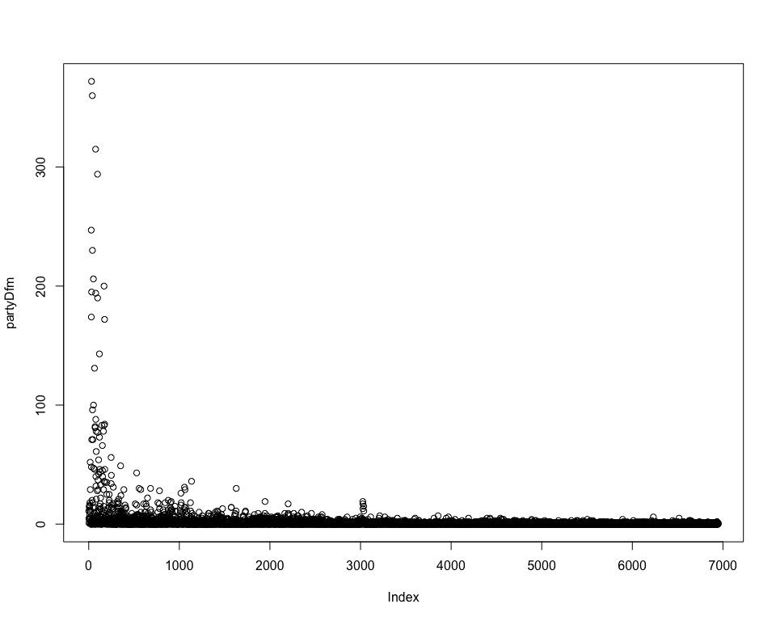

This file demonstrates a basic workflow to take some pre-loaded texts
and perform elementary text analysis tasks quickly. The **quanteda**
package comes with a built-in set of inaugural addresses from US
Presidents. We begin by loading quanteda and examining these texts. The
`summary` command will output the name of each text along with the
number of types, tokens and sentences contained in the text. Below we
use R’s indexing syntax to selectivly use the summary command on the
first five texts.

``` r
library("quanteda")
```

    ## quanteda version 0.99.22

    ## Using 7 of 8 threads for parallel computing

    ## 
    ## Attaching package: 'quanteda'

    ## The following object is masked from 'package:utils':
    ## 
    ##     View

``` r
summary(data_corpus_inaugural, 10)
```

    ## Corpus consisting of 58 documents, showing 10 documents:
    ## 
    ##             Text Types Tokens Sentences Year  President   FirstName
    ##  1789-Washington   625   1538        23 1789 Washington      George
    ##  1793-Washington    96    147         4 1793 Washington      George
    ##       1797-Adams   826   2578        37 1797      Adams        John
    ##   1801-Jefferson   717   1927        41 1801  Jefferson      Thomas
    ##   1805-Jefferson   804   2381        45 1805  Jefferson      Thomas
    ##     1809-Madison   535   1263        21 1809    Madison       James
    ##     1813-Madison   541   1302        33 1813    Madison       James
    ##      1817-Monroe  1040   3680       121 1817     Monroe       James
    ##      1821-Monroe  1259   4886       129 1821     Monroe       James
    ##       1825-Adams  1003   3152        74 1825      Adams John Quincy
    ## 
    ## Source:  Gerhard Peters and John T. Woolley. The American Presidency Project.
    ## Created: Tue Jun 13 14:51:47 2017
    ## Notes:   http://www.presidency.ucsb.edu/inaugurals.php

A corpus object can have document variables. These are accessed using
the `docvars()` function.

``` r
docvars(data_corpus_inaugural) %>% head()
```

    ##                 Year  President FirstName
    ## 1789-Washington 1789 Washington    George
    ## 1793-Washington 1793 Washington    George
    ## 1797-Adams      1797      Adams      John
    ## 1801-Jefferson  1801  Jefferson    Thomas
    ## 1805-Jefferson  1805  Jefferson    Thomas
    ## 1809-Madison    1809    Madison     James

As indicated here, the “pipe” function `%>%` from the **magrittr**
package is automatically supported by **quanteda**. Here, we have
extracted the data.frame of the document variables, and piped this to
the `head()` function to display the first six rows of this data.

**quanteda**’s `tokens()` function can be used on a simple character
vector, a vector of character vectors, or a corpus. Here are some
examples:

``` r
tokens("Today is Thursday in Canberra. It is yesterday in London.")
```

    ## tokens from 1 document.
    ## text1 :
    ##  [1] "Today"     "is"        "Thursday"  "in"        "Canberra" 
    ##  [6] "."         "It"        "is"        "yesterday" "in"       
    ## [11] "London"    "."

``` r
vec <- c(one = "This is text one", two = "This, however, is the second text")
vec
```

    ##                                 one                                 two 
    ##                  "This is text one" "This, however, is the second text"

``` r
tokens(vec)
```

    ## tokens from 2 documents.
    ## one :
    ## [1] "This" "is"   "text" "one" 
    ## 
    ## two :
    ## [1] "This"    ","       "however" ","       "is"      "the"     "second" 
    ## [8] "text"

Consider the default arguments to the tokenize function. To remove
punctuation, you should set the `removePunct` argument to be TRUE. We
can combine this with the `toLower` function to get a cleaned and
tokenized version of our text.

``` r
tokens(vec, removePunct = TRUE) %>% tokens_tolower()
```

    ## tokens from 2 documents.
    ## one :
    ## [1] "this" "is"   "text" "one" 
    ## 
    ## two :
    ## [1] "this"    ","       "however" ","       "is"      "the"     "second" 
    ## [8] "text"

Using this function with the inaugural addresses:

``` r
inaug_tokens <- tokens(data_corpus_inaugural) %>% tokens_tolower()
inaug_tokens[2]
```

    ## tokens from 1 document.
    ## 1793-Washington :
    ##   [1] "fellow"         "citizens"       ","              "i"             
    ##   [5] "am"             "again"          "called"         "upon"          
    ##   [9] "by"             "the"            "voice"          "of"            
    ##  [13] "my"             "country"        "to"             "execute"       
    ##  [17] "the"            "functions"      "of"             "its"           
    ##  [21] "chief"          "magistrate"     "."              "when"          
    ##  [25] "the"            "occasion"       "proper"         "for"           
    ##  [29] "it"             "shall"          "arrive"         ","             
    ##  [33] "i"              "shall"          "endeavor"       "to"            
    ##  [37] "express"        "the"            "high"           "sense"         
    ##  [41] "i"              "entertain"      "of"             "this"          
    ##  [45] "distinguished"  "honor"          ","              "and"           
    ##  [49] "of"             "the"            "confidence"     "which"         
    ##  [53] "has"            "been"           "reposed"        "in"            
    ##  [57] "me"             "by"             "the"            "people"        
    ##  [61] "of"             "united"         "america"        "."             
    ##  [65] "previous"       "to"             "the"            "execution"     
    ##  [69] "of"             "any"            "official"       "act"           
    ##  [73] "of"             "the"            "president"      "the"           
    ##  [77] "constitution"   "requires"       "an"             "oath"          
    ##  [81] "of"             "office"         "."              "this"          
    ##  [85] "oath"           "i"              "am"             "now"           
    ##  [89] "about"          "to"             "take"           ","             
    ##  [93] "and"            "in"             "your"           "presence"      
    ##  [97] ":"              "that"           "if"             "it"            
    ## [101] "shall"          "be"             "found"          "during"        
    ## [105] "my"             "administration" "of"             "the"           
    ## [109] "government"     "i"              "have"           "in"            
    ## [113] "any"            "instance"       "violated"       "willingly"     
    ## [117] "or"             "knowingly"      "the"            "injunctions"   
    ## [121] "thereof"        ","              "i"              "may"           
    ## [125] "("              "besides"        "incurring"      "constitutional"
    ## [129] "punishment"     ")"              "be"             "subject"       
    ## [133] "to"             "the"            "upbraidings"    "of"            
    ## [137] "all"            "who"            "are"            "now"           
    ## [141] "witnesses"      "of"             "the"            "present"       
    ## [145] "solemn"         "ceremony"       "."

Once each text has been split into words, we can use the `dfm()`
constructor function to create a matrix of counts of the occurrences of
each word in each document:

``` r
inaug_dfm <- dfm(inaug_tokens)
trimmed_inaug_dfm <- dfm_trim(inaug_dfm, min_docfreq = 5, min_count = 10)
weighted_trimmed_dfm <- dfm_weight(trimmed_inaug_dfm, type = "tfidf")
head(weighted_trimmed_dfm)
```

    ## Document-feature matrix of: 6 documents, 6 features (30.6% sparse).
    ## 6 x 6 sparse Matrix of class "dfm"
    ##                  features
    ## docs              fellow-citizens of the    senate and    house
    ##   1789-Washington       0.4846744  0   0 0.8091855   0 1.720676
    ##   1793-Washington       0          0   0 0           0 0       
    ##   1797-Adams            1.4540232  0   0 0.8091855   0 0       
    ##   1801-Jefferson        0.9693488  0   0 0           0 0       
    ##   1805-Jefferson        0          0   0 0           0 0       
    ##   1809-Madison          0.4846744  0   0 0           0 0

Using pipes, we could have simplified this easily:

``` r
inaug_tokens %>% 
  dfm() %>%
  dfm_trim(min_docfreq = 5, min_count = 10) %>%
  dfm_weight(type = "tfidf") %>%
  head()
```

    ## Document-feature matrix of: 6 documents, 6 features (30.6% sparse).
    ## 6 x 6 sparse Matrix of class "dfm"
    ##                  features
    ## docs              fellow-citizens of the    senate and    house
    ##   1789-Washington       0.4846744  0   0 0.8091855   0 1.720676
    ##   1793-Washington       0          0   0 0           0 0       
    ##   1797-Adams            1.4540232  0   0 0.8091855   0 0       
    ##   1801-Jefferson        0.9693488  0   0 0           0 0       
    ##   1805-Jefferson        0          0   0 0           0 0       
    ##   1809-Madison          0.4846744  0   0 0           0 0

Note that `dfm()` works on a variety of object types, including
character vectors, corpus objects, and tokenized text objects. This
gives the user maximum flexibility and power, while also making it easy
to achieve similar results by going directly from texts to a
document-by-feature matrix.

To see what objects for which any particular *method* (function) is
defined, you can use the `methods()` function:

``` r
methods(dfm)
```

    ## [1] dfm.character* dfm.corpus*    dfm.dfm*       dfm.tokens*   
    ## see '?methods' for accessing help and source code

Likewise, you can also figure out what methods are defined for any given
*class* of object, using the same function:

``` r
methods(class = "tokens")
```

    ##  [1] [                     [[                    [[<-                 
    ##  [4] [<-                   +                     $                    
    ##  [7] as.character          as.list               c                    
    ## [10] dfm                   docnames              docnames<-           
    ## [13] docvars               docvars<-             fcm                  
    ## [16] kwic                  lengths               metadoc              
    ## [19] ndoc                  nfeature              nsentence            
    ## [22] nsyllable             ntoken                ntype                
    ## [25] phrase                print                 textplot_wordcloud   
    ## [28] textstat_collocations tokens_compound       tokens_lookup        
    ## [31] tokens_ngrams         tokens_replace        tokens_segment       
    ## [34] tokens_select         tokens_tolower        tokens_toupper       
    ## [37] tokens_wordstem       tokens                types                
    ## [40] unlist               
    ## see '?methods' for accessing help and source code

If we are interested in analysing the texts with respect to some other
variables, we can create a corpus object to associate the texts with
this metadata. For example, consider the last six inaugural addresses:

``` r
summary(corpus_subset(data_corpus_inaugural, Year > 1993))
```

    ## Corpus consisting of 6 documents:
    ## 
    ##          Text Types Tokens Sentences Year President FirstName
    ##  1997-Clinton   773   2449       111 1997   Clinton      Bill
    ##     2001-Bush   621   1808        97 2001      Bush George W.
    ##     2005-Bush   773   2319       100 2005      Bush George W.
    ##    2009-Obama   938   2711       110 2009     Obama    Barack
    ##    2013-Obama   814   2317        88 2013     Obama    Barack
    ##    2017-Trump   582   1660        88 2017     Trump Donald J.
    ## 
    ## Source:  Gerhard Peters and John T. Woolley. The American Presidency Project.
    ## Created: Tue Jun 13 14:51:47 2017
    ## Notes:   http://www.presidency.ucsb.edu/inaugurals.php

We can use the `docvars()` option to the `corpus()` command to record
the party with which each text is associated:

``` r
dv <- data.frame(Party = c("dem", "rep", "rep", "dem", "dem", "notreallyrep"))
txts <- texts(corpus_subset(data_corpus_inaugural, Year > 1993))
recentCorpus <- corpus(txts, docvars = dv)
summary(recentCorpus)
```

    ## Corpus consisting of 6 documents:
    ## 
    ##          Text Types Tokens Sentences        Party
    ##  1997-Clinton   773   2449       111          dem
    ##     2001-Bush   621   1808        97          rep
    ##     2005-Bush   773   2319       100          rep
    ##    2009-Obama   938   2711       110          dem
    ##    2013-Obama   814   2317        88          dem
    ##    2017-Trump   582   1660        88 notreallyrep
    ## 
    ## Source:  /Users/kbenoit/Dropbox (Personal)/GitHub/QTAUR-halfday/1_getting_started/* on x86_64 by kbenoit
    ## Created: Wed Nov 15 09:09:18 2017
    ## Notes:

We can use this metadata to combine features across documents when
creating a document-feature matrix:

``` r
partyDfm <- dfm(recentCorpus, groups = "Party", ignoredFeatures = stopwords("english"),                  verbose = FALSE)
plot(partyDfm, comparison = TRUE)
```


