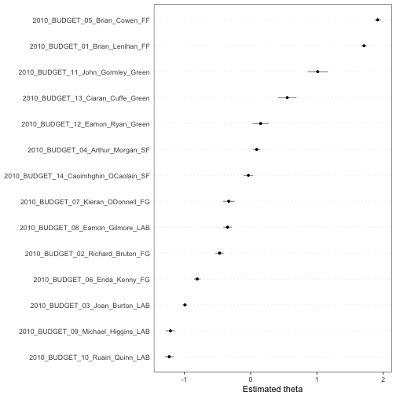

Advanced analysis using quanteda
========================================================
author: Ken Benoit
date: 2017-11-15
autosize: true
css: custom.css
font-family: arial


Advanced analysis using quanteda
================================

**quanteda** has the following advanced functionality:

* extensive weighting functions, such as _tf-idf_
* extensive feature selection options, using fixed matching, "glob" matching, and regular expression matching
* ability to constuct a feature co-occurrence matrix, including weighted variations 
    - for input to _word2vec_, **text2vec**, etc.

"textual statistics" functions
==============================

name               | function
-------------------|-----------------
`textstat_collocations` |	calculate collocation statistics
`textstat_dist` |	distance computation between documents or features
`textstat_keyness` |	calculate keyness statistics
`textstat_lexdiv` |	calculate lexical diversity
`textstat_readability` |	calculate readability
`textstat_simil` |	similarity computation between documents or features

"text model" functions
======================

name               | function
-------------------|-----------------
`textmodel_ca` |	correspondence analysis of a document-feature matrix
`textmodel_nb` |	Naive Bayes (multinomial, Bernoulli) classifier for texts
`textmodel_wordfish` | Slapin and Proksch (2008) text scaling model
`textmodel_wordscores` |	Laver, Benoit and Garry (2003) text scaling
`textmodel_wordshoal`	| Lauderdale and Herzog (2017) text scaling model
`textmodel_affinity`	| (coming soon) Perry and Benoit (2017) class affinity scaling
`coef.textmodel` | extract coefficients from a `textmodel`

text plotting functions
=======================

name               | function
-------------------|-----------------
`textplot_scale1d` |	plot a fitted scaling model
`textplot_wordcloud` |	plot features as a wordcloud
`textplot_xray` |	plot the dispersion of key word(s)
`textplot_keyness` | plot association of words with target v. reference set

works very well with other packages
===================================

* `convert()` will transform a **quanteda** `dfm` into any number of "foreign" formats
* can convert to and from the "tidy" format of the **tidytext** package

Example 1: Text scaling with "Wordfish"
=======================================


```r
data_dfm_irishbudget2010 <- dfm(data_corpus_irishbudget2010, 
                                remove_punct = TRUE, 
                                remove_numbers = TRUE, 
                                remove = stopwords("english"),
                                verbose = TRUE)
wfm <- textmodel_wordfish(data_dfm_irishbudget2010, dir = c(6, 5))
```


====


```r
summary(wfm)
## Call:
## 	textmodel_wordfish.dfm(x = data_dfm_irishbudget2010, dir = c(6, 
##     5))
## 
## Estimated document positions:
##                                             theta         SE       lower
## 2010_BUDGET_01_Brian_Lenihan_FF        1.70795688 0.02302764  1.66282271
## 2010_BUDGET_02_Richard_Bruton_FG      -0.46894171 0.03160693 -0.53089130
## 2010_BUDGET_03_Joan_Burton_LAB        -0.99195937 0.01832909 -1.02788439
## 2010_BUDGET_04_Arthur_Morgan_SF        0.09009068 0.02935165  0.03256145
## 2010_BUDGET_05_Brian_Cowen_FF          1.91374321 0.02510324  1.86454087
## 2010_BUDGET_06_Enda_Kenny_FG          -0.80733182 0.02610126 -0.85849029
## 2010_BUDGET_07_Kieran_ODonnell_FG     -0.33048413 0.04548639 -0.41963745
## 2010_BUDGET_08_Eamon_Gilmore_LAB      -0.34902381 0.03265230 -0.41302232
## 2010_BUDGET_09_Michael_Higgins_LAB    -1.21169589 0.03578758 -1.28183956
## 2010_BUDGET_10_Ruairi_Quinn_LAB       -1.22872089 0.03505587 -1.29743040
## 2010_BUDGET_11_John_Gormley_Green      1.01015217 0.07696475  0.85930126
## 2010_BUDGET_12_Eamon_Ryan_Green        0.15005071 0.06307838  0.02641708
## 2010_BUDGET_13_Ciaran_Cuffe_Green      0.55095134 0.07155755  0.41069854
## 2010_BUDGET_14_Caoimhghin_OCaolain_SF -0.03478737 0.03698780 -0.10728345
##                                            upper
## 2010_BUDGET_01_Brian_Lenihan_FF        1.7530911
## 2010_BUDGET_02_Richard_Bruton_FG      -0.4069921
## 2010_BUDGET_03_Joan_Burton_LAB        -0.9560343
## 2010_BUDGET_04_Arthur_Morgan_SF        0.1476199
## 2010_BUDGET_05_Brian_Cowen_FF          1.9629456
## 2010_BUDGET_06_Enda_Kenny_FG          -0.7561733
## 2010_BUDGET_07_Kieran_ODonnell_FG     -0.2413308
## 2010_BUDGET_08_Eamon_Gilmore_LAB      -0.2850253
## 2010_BUDGET_09_Michael_Higgins_LAB    -1.1415522
## 2010_BUDGET_10_Ruairi_Quinn_LAB       -1.1600114
## 2010_BUDGET_11_John_Gormley_Green      1.1610031
## 2010_BUDGET_12_Eamon_Ryan_Green        0.2736843
## 2010_BUDGET_13_Ciaran_Cuffe_Green      0.6912041
## 2010_BUDGET_14_Caoimhghin_OCaolain_SF  0.0377087
```

====


```r
textplot_scale1d(wfm)
```


====


```r
textplot_scale1d(wfm, groups = docvars(data_corpus_irishbudget2010, "party"))
```



====


```r
textplot_scale1d(wfm, margin = "features",
                 highlighted = c("budget", "productivity", "economy", 
                                 "societies", "screwed", "christmas"))
```


Example 2: Text scaling with "Wordscores"
=========================================


```r
wsm <- textmodel_wordscores(data_dfm_irishbudget2010, 
                            y = c(1, NA, NA, -1, rep(NA, 10)), smooth = 1)
wsp <- predict(wsm, rescaling = "mv")
wsp
## Predicted textmodel of type: wordscores
## 
##                                       textscore LBG se   ci lo   ci hi
## 2010_BUDGET_01_Brian_Lenihan_FF          0.1188 0.0035  0.1120  0.1256
## 2010_BUDGET_02_Richard_Bruton_FG        -0.0326 0.0036 -0.0398 -0.0255
## 2010_BUDGET_03_Joan_Burton_LAB          -0.0335 0.0034 -0.0403 -0.0268
## 2010_BUDGET_04_Arthur_Morgan_SF         -0.1188 0.0036 -0.1258 -0.1118
## 2010_BUDGET_05_Brian_Cowen_FF            0.0261 0.0035  0.0193  0.0330
## 2010_BUDGET_06_Enda_Kenny_FG            -0.0371 0.0036 -0.0442 -0.0300
## 2010_BUDGET_07_Kieran_ODonnell_FG       -0.0298 0.0037 -0.0371 -0.0225
## 2010_BUDGET_08_Eamon_Gilmore_LAB        -0.0311 0.0037 -0.0383 -0.0239
## 2010_BUDGET_09_Michael_Higgins_LAB      -0.0300 0.0037 -0.0374 -0.0227
## 2010_BUDGET_10_Ruairi_Quinn_LAB         -0.0303 0.0038 -0.0378 -0.0228
## 2010_BUDGET_11_John_Gormley_Green       -0.0186 0.0039 -0.0261 -0.0110
## 2010_BUDGET_12_Eamon_Ryan_Green         -0.0232 0.0038 -0.0307 -0.0158
## 2010_BUDGET_13_Ciaran_Cuffe_Green       -0.0257 0.0038 -0.0331 -0.0183
## 2010_BUDGET_14_Caoimhghin_OCaolain_SF   -0.0385 0.0036 -0.0456 -0.0313
##                                       MV rescaled textscore_mv_lo
## 2010_BUDGET_01_Brian_Lenihan_FF            1.0000          0.9430
## 2010_BUDGET_02_Richard_Bruton_FG          -0.2747         -0.3346
## 2010_BUDGET_03_Joan_Burton_LAB            -0.2823         -0.3392
## 2010_BUDGET_04_Arthur_Morgan_SF           -1.0000         -1.0588
## 2010_BUDGET_05_Brian_Cowen_FF              0.2199          0.1620
## 2010_BUDGET_06_Enda_Kenny_FG              -0.3119         -0.3716
## 2010_BUDGET_07_Kieran_ODonnell_FG         -0.2511         -0.3126
## 2010_BUDGET_08_Eamon_Gilmore_LAB          -0.2618         -0.3224
## 2010_BUDGET_09_Michael_Higgins_LAB        -0.2527         -0.3144
## 2010_BUDGET_10_Ruairi_Quinn_LAB           -0.2551         -0.3180
## 2010_BUDGET_11_John_Gormley_Green         -0.1563         -0.2198
## 2010_BUDGET_12_Eamon_Ryan_Green           -0.1956         -0.2583
## 2010_BUDGET_13_Ciaran_Cuffe_Green         -0.2166         -0.2788
## 2010_BUDGET_14_Caoimhghin_OCaolain_SF     -0.3236         -0.3838
##                                       textscore_mv_hi
## 2010_BUDGET_01_Brian_Lenihan_FF                1.0570
## 2010_BUDGET_02_Richard_Bruton_FG              -0.2149
## 2010_BUDGET_03_Joan_Burton_LAB                -0.2254
## 2010_BUDGET_04_Arthur_Morgan_SF               -0.9412
## 2010_BUDGET_05_Brian_Cowen_FF                  0.2777
## 2010_BUDGET_06_Enda_Kenny_FG                  -0.2522
## 2010_BUDGET_07_Kieran_ODonnell_FG             -0.1895
## 2010_BUDGET_08_Eamon_Gilmore_LAB              -0.2013
## 2010_BUDGET_09_Michael_Higgins_LAB            -0.1910
## 2010_BUDGET_10_Ruairi_Quinn_LAB               -0.1921
## 2010_BUDGET_11_John_Gormley_Green             -0.0928
## 2010_BUDGET_12_Eamon_Ryan_Green               -0.1329
## 2010_BUDGET_13_Ciaran_Cuffe_Green             -0.1544
## 2010_BUDGET_14_Caoimhghin_OCaolain_SF         -0.2634
```


==================


```r
textplot_scale1d(wsp, groups = docvars(data_corpus_irishbudget2010, "party"))
```


Example 3: Topic models with movie reviews
==========================================


```r
data(data_corpus_movies, package = "quantedaData")
data_corpus_movies
## Corpus consisting of 2,000 documents and 3 docvars.

# prepare the dfm
moviesDfm <- dfm(data_corpus_movies, remove = stopwords("SMART")) %>%
  dfm_trim(min_count = 5)
moviesDfm
## Document-feature matrix of: 2,000 documents, 14,670 features (98.6% sparse).
```

====


```r
# MCMC and model tuning parameters
K <- 20
G <- 5000
alpha <- 0.02
eta <- 0.02

# convert to lda format
moviesDfmlda <- convert(moviesDfm, to = "lda")
# fit the model
library("lda")
set.seed(357)
t1 <- Sys.time()
fit <- lda.collapsed.gibbs.sampler(documents = moviesDfmlda$documents, K = K, 
                                   vocab = moviesDfmlda$vocab, 
                                   num.iterations = G, alpha = alpha, 
                                   eta = eta, initial = NULL, burnin = 0,
                                   compute.log.likelihood = TRUE)
t2 <- Sys.time()
t2 - t1  # about 14 minutes on Ken's MacBook Pro
```

====


```r
library("LDAvis")
# create the JSON object to feed the visualization:
json <- createJSON(phi = t(apply(t(fit$topics) + eta, 2, function(x) x/sum(x))), 
                   theta = t(apply(fit$document_sums + alpha, 2, function(x) x/sum(x))), 
                   doc.length = ntoken(moviesDfm), 
                   vocab = featnames(moviesDfm), 
                   term.frequency = colSums(moviesDfm))
serVis(json, out.dir = "visColl", open.browser = TRUE)
```

====

[View the resulting visualization](3_advanced/visColl/index.html)

