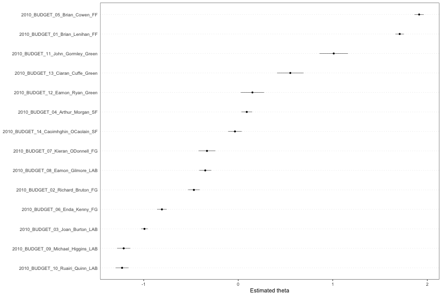
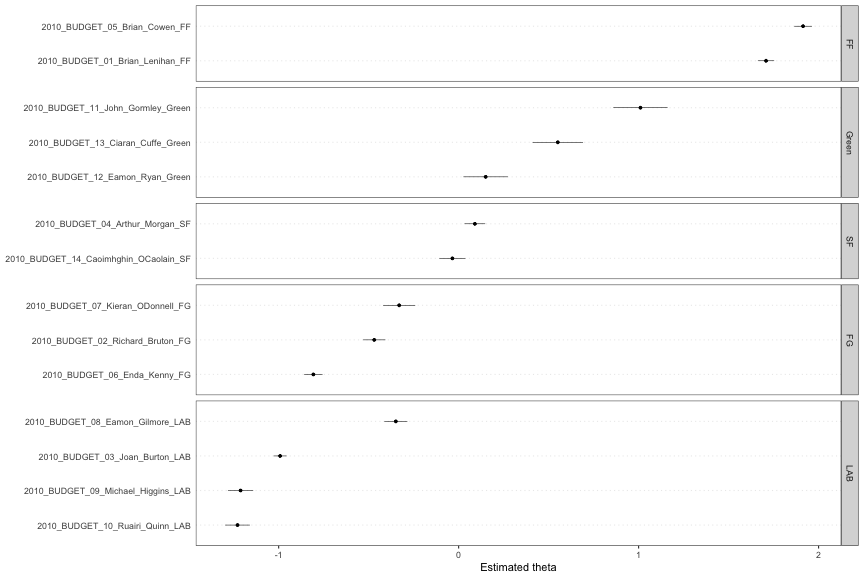
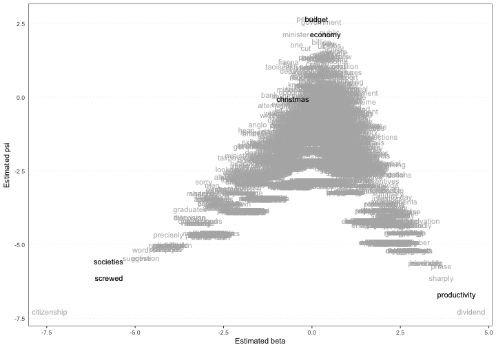
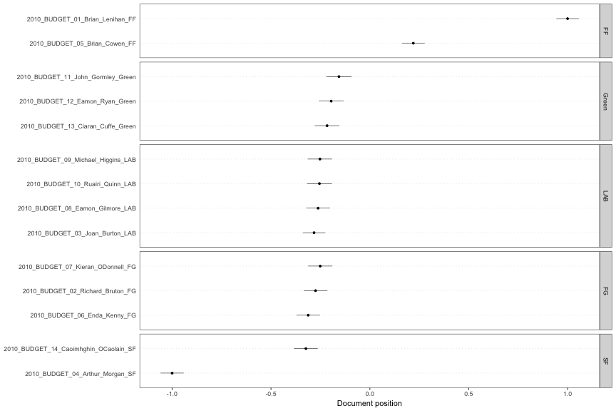

Advanced analysis using quanteda
========================================================
author: Ken Benoit
date: 2017-11-15
autosize: true
css: custom.css
font-family: arial


Advanced analysis using quanteda
================================

**quanteda** has the following advanced functionality:

* extensive weighting functions, such as _tf-idf_
* extensive feature selection options, using fixed matching, "glob" matching, and regular expression matching
* ability to constuct a feature co-occurrence matrix, including weighted variations 
    - for input to _word2vec_, **text2vec**, etc.

"textual statistics" functions
==============================

name               | function
-------------------|-----------------
`textstat_collocations` |	calculate collocation statistics
`textstat_dist` |	distance computation between documents or features
`textstat_keyness` |	calculate keyness statistics
`textstat_lexdiv` |	calculate lexical diversity
`textstat_readability` |	calculate readability
`textstat_simil` |	similarity computation between documents or features

"text model" functions
======================

name               | function
-------------------|-----------------
`textmodel_ca` |	correspondence analysis of a document-feature matrix
`textmodel_nb` |	Naive Bayes (multinomial, Bernoulli) classifier for texts
`textmodel_wordfish` | Slapin and Proksch (2008) text scaling model
`textmodel_wordscores` |	Laver, Benoit and Garry (2003) text scaling
`textmodel_wordshoal`	| Lauderdale and Herzog (2017) text scaling model
`textmodel_affinity`	| (coming soon) Perry and Benoit (2017) class affinity scaling
`coef.textmodel` | extract coefficients from a `textmodel`

text plotting functions
=======================

name               | function
-------------------|-----------------
`textplot_scale1d` |	plot a fitted scaling model
`textplot_wordcloud` |	plot features as a wordcloud
`textplot_xray` |	plot the dispersion of key word(s)
`textplot_keyness` | plot association of words with target v. reference set

works very well with other packages
===================================

* `convert()` will transform a **quanteda** `dfm` into any number of "foreign" formats
* can convert to and from the "tidy" format of the **tidytext** package


works well with spacyr
==========================

* the R package **spacyr** provides an interface to the Python module [spaCy](spacy.io)
* part of speech tagging and dependency parsing in 6+ languages
* super fast

====


```r
library("spacyr")
spacy_initialize()
(sp <- spacy_parse(data_char_paragraph)) %>% head(10)
##    doc_id sentence_id token_id      token      lemma   pos entity
## 1   text1           1        1    Instead    instead   ADV       
## 2   text1           1        2         we     -PRON-  PRON       
## 3   text1           1        3       have       have  VERB       
## 4   text1           1        4          a          a   DET       
## 5   text1           1        5       Fine       fine   ADJ  ORG_B
## 6   text1           1        6       Gael       gael PROPN  ORG_I
## 7   text1           1        7          -          - PUNCT  ORG_I
## 8   text1           1        8     Labour     labour PROPN  ORG_I
## 9   text1           1        9      Party      party PROPN  ORG_I
## 10  text1           1       10 Government government PROPN  ORG_I
```

====


```r
entity_extract(sp)
##    doc_id sentence_id                              entity entity_type
## 1   text1           1 Fine Gael - Labour Party Government         ORG
## 2   text1           2                                  EU         ORG
## 3   text1           2                                 ECB         ORG
## 4   text1           2                               Irish        NORP
## 5   text1           2                              German        NORP
## 6   text1           2                              French        NORP
## 7   text1           2                             British        NORP
## 8   text1           2                               Irish        NORP
## 9   text1           2                               Irish        NORP
## 10  text1           3                 an Irish Government         ORG
## 11  text1           3                               State         ORG
## 12  text1           3             the Republic of Ireland         GPE
## 13  text1           3                              Europe         LOC
## 14  text1           4                               Irish        NORP
## 15  text1          11                                 VAT         ORG
## 16  text1          13                         Fianna Fáil      PERSON
```

Example 1: Text scaling with "Wordfish"
=======================================


```r
data_dfm_irishbudget2010 <- dfm(data_corpus_irishbudget2010, 
                                remove_punct = TRUE, 
                                remove_numbers = TRUE, 
                                remove = stopwords("english"),
                                verbose = TRUE)
wfm <- textmodel_wordfish(data_dfm_irishbudget2010, dir = c(6, 5))
```


====


```r
summary(wfm)
## Call:
## 	textmodel_wordfish.dfm(x = data_dfm_irishbudget2010, dir = c(6, 
##     5))
## 
## Estimated document positions:
##                                             theta         SE       lower       upper
## 2010_BUDGET_01_Brian_Lenihan_FF        1.70795756 0.02302766  1.66282335  1.75309177
## 2010_BUDGET_02_Richard_Bruton_FG      -0.46893249 0.03160704 -0.53088228 -0.40698269
## 2010_BUDGET_03_Joan_Burton_LAB        -0.99195687 0.01832910 -1.02788190 -0.95603183
## 2010_BUDGET_04_Arthur_Morgan_SF        0.09008940 0.02935163  0.03256021  0.14761859
## 2010_BUDGET_05_Brian_Cowen_FF          1.91374370 0.02510326  1.86454131  1.96294610
## 2010_BUDGET_06_Enda_Kenny_FG          -0.80733681 0.02610114 -0.85849505 -0.75617856
## 2010_BUDGET_07_Kieran_ODonnell_FG     -0.33048775 0.04548628 -0.41964085 -0.24133465
## 2010_BUDGET_08_Eamon_Gilmore_LAB      -0.34902516 0.03265226 -0.41302358 -0.28502673
## 2010_BUDGET_09_Michael_Higgins_LAB    -1.21169615 0.03578750 -1.28183965 -1.14155265
## 2010_BUDGET_10_Ruairi_Quinn_LAB       -1.22872023 0.03505582 -1.29742965 -1.16001082
## 2010_BUDGET_11_John_Gormley_Green      1.01015129 0.07696478  0.85930032  1.16100226
## 2010_BUDGET_12_Eamon_Ryan_Green        0.15005155 0.06307837  0.02641795  0.27368514
## 2010_BUDGET_13_Ciaran_Cuffe_Green      0.55095187 0.07155755  0.41069906  0.69120468
## 2010_BUDGET_14_Caoimhghin_OCaolain_SF -0.03478992 0.03698775 -0.10728591  0.03770606
```

====


```r
textplot_scale1d(wfm)
```



====


```r
textplot_scale1d(wfm, groups = docvars(data_corpus_irishbudget2010, "party"))
```



====


```r
textplot_scale1d(wfm, margin = "features",
                 highlighted = c("budget", "productivity", "economy", 
                                 "societies", "screwed", "christmas"))
```



Example 2: Text scaling with "Wordscores"
=========================================


```r
wsm <- textmodel_wordscores(data_dfm_irishbudget2010, 
                            y = c(1, NA, NA, -1, rep(NA, 10)), smooth = 1)
wsp <- predict(wsm, rescaling = "mv")
wsp
## Predicted textmodel of type: wordscores
## 
##                                       textscore LBG se   ci lo   ci hi MV rescaled textscore_mv_lo
## 2010_BUDGET_01_Brian_Lenihan_FF          0.1188 0.0035  0.1120  0.1256      1.0000          0.9430
## 2010_BUDGET_02_Richard_Bruton_FG        -0.0326 0.0036 -0.0398 -0.0255     -0.2747         -0.3346
## 2010_BUDGET_03_Joan_Burton_LAB          -0.0335 0.0034 -0.0403 -0.0268     -0.2823         -0.3392
## 2010_BUDGET_04_Arthur_Morgan_SF         -0.1188 0.0036 -0.1258 -0.1118     -1.0000         -1.0588
## 2010_BUDGET_05_Brian_Cowen_FF            0.0261 0.0035  0.0193  0.0330      0.2199          0.1620
## 2010_BUDGET_06_Enda_Kenny_FG            -0.0371 0.0036 -0.0442 -0.0300     -0.3119         -0.3716
## 2010_BUDGET_07_Kieran_ODonnell_FG       -0.0298 0.0037 -0.0371 -0.0225     -0.2511         -0.3126
## 2010_BUDGET_08_Eamon_Gilmore_LAB        -0.0311 0.0037 -0.0383 -0.0239     -0.2618         -0.3224
## 2010_BUDGET_09_Michael_Higgins_LAB      -0.0300 0.0037 -0.0374 -0.0227     -0.2527         -0.3144
## 2010_BUDGET_10_Ruairi_Quinn_LAB         -0.0303 0.0038 -0.0378 -0.0228     -0.2551         -0.3180
## 2010_BUDGET_11_John_Gormley_Green       -0.0186 0.0039 -0.0261 -0.0110     -0.1563         -0.2198
## 2010_BUDGET_12_Eamon_Ryan_Green         -0.0232 0.0038 -0.0307 -0.0158     -0.1956         -0.2583
## 2010_BUDGET_13_Ciaran_Cuffe_Green       -0.0257 0.0038 -0.0331 -0.0183     -0.2166         -0.2788
## 2010_BUDGET_14_Caoimhghin_OCaolain_SF   -0.0385 0.0036 -0.0456 -0.0313     -0.3236         -0.3838
##                                       textscore_mv_hi
## 2010_BUDGET_01_Brian_Lenihan_FF                1.0570
## 2010_BUDGET_02_Richard_Bruton_FG              -0.2149
## 2010_BUDGET_03_Joan_Burton_LAB                -0.2254
## 2010_BUDGET_04_Arthur_Morgan_SF               -0.9412
## 2010_BUDGET_05_Brian_Cowen_FF                  0.2777
## 2010_BUDGET_06_Enda_Kenny_FG                  -0.2522
## 2010_BUDGET_07_Kieran_ODonnell_FG             -0.1895
## 2010_BUDGET_08_Eamon_Gilmore_LAB              -0.2013
## 2010_BUDGET_09_Michael_Higgins_LAB            -0.1910
## 2010_BUDGET_10_Ruairi_Quinn_LAB               -0.1921
## 2010_BUDGET_11_John_Gormley_Green             -0.0928
## 2010_BUDGET_12_Eamon_Ryan_Green               -0.1329
## 2010_BUDGET_13_Ciaran_Cuffe_Green             -0.1544
## 2010_BUDGET_14_Caoimhghin_OCaolain_SF         -0.2634
```


==================


```r
textplot_scale1d(wsp, groups = docvars(data_corpus_irishbudget2010, "party"))
```



Example 3: Topic models with movie reviews
==========================================


```r
data(data_corpus_movies, package = "quantedaData")
data_corpus_movies
## Corpus consisting of 2,000 documents and 3 docvars.

# prepare the dfm
moviesDfm <- dfm(data_corpus_movies, remove = stopwords("SMART"), 
                 remove_punct = TRUE, remove_numbers = TRUE) %>%
  dfm_trim(min_count = 5)
moviesDfm
## Document-feature matrix of: 2,000 documents, 14,517 features (98.6% sparse).
```

====


```r
# MCMC and model tuning parameters
K <- 20
G <- 5000
alpha <- 0.02
eta <- 0.02

# convert to lda format
moviesDfmlda <- convert(moviesDfm, to = "lda")
# fit the model
library("lda")
set.seed(357)
t1 <- Sys.time()
fit <- lda.collapsed.gibbs.sampler(documents = moviesDfmlda$documents, K = K, 
                                   vocab = moviesDfmlda$vocab, 
                                   num.iterations = G, alpha = alpha, 
                                   eta = eta, initial = NULL, burnin = 0,
                                   compute.log.likelihood = TRUE)
t2 <- Sys.time()
t2 - t1  # about 14 minutes on Ken's MacBook Pro
```

====


```r
library("LDAvis")
# create the JSON object to feed the visualization:
json <- createJSON(phi = t(apply(t(fit$topics) + eta, 2, function(x) x/sum(x))), 
                   theta = t(apply(fit$document_sums + alpha, 2, function(x) x/sum(x))), 
                   doc.length = ntoken(moviesDfm), 
                   vocab = featnames(moviesDfm), 
                   term.frequency = colSums(moviesDfm))
serVis(json, out.dir = "visColl", open.browser = TRUE)
```

====

[View the resulting visualization](https://rawgit.com/kbenoit/QTAUR-halfday/master/3_advanced/visColl/)

