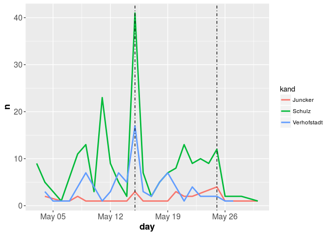
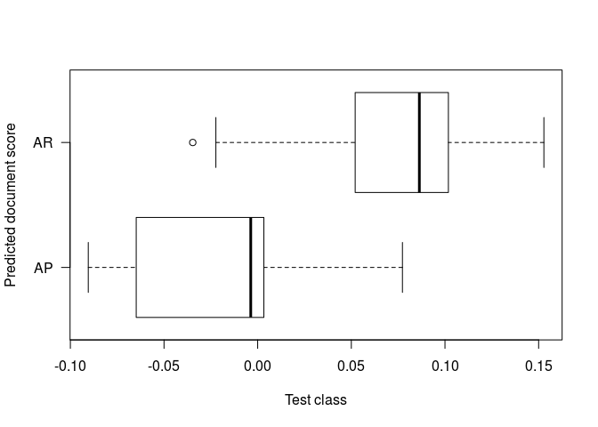
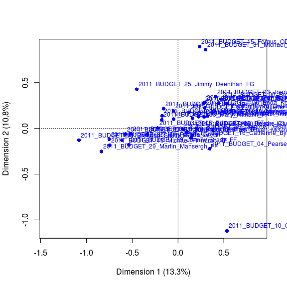
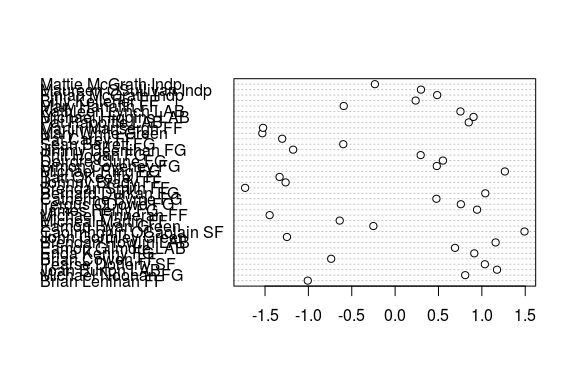

Advanced Examples
================
Kenneth Benoit
15 November 2017

Advanced examples
-----------------

In this section we will explore some text analysis and analysis of metadata from a corpus of tweets retrieved from the Twitter API. The tweets are a small sample from a collection of tweets relating to the European Parliament elections of 2015.

Load the data frame containing the sample tweets:

``` r
library("quanteda")
```

    ## quanteda version 0.99.20

    ## Using 3 of 4 threads for parallel computing

    ## 
    ## Attaching package: 'quanteda'

    ## The following object is masked from 'package:utils':
    ## 
    ##     View

``` r
load("tweetSample.RData")
str(tweetSample)
```

    ## 'data.frame':    10000 obs. of  35 variables:
    ##  $ created_at          : chr  "2014-05-28 15:53:33+00:00" "2014-05-30 08:32:13+00:00" "2014-05-29 19:22:15+00:00" "2014-05-03 20:23:43+00:00" ...
    ##  $ geo_latitude        : num  NA NA NA NA NA NA NA NA NA NA ...
    ##  $ geo_longitude       : num  NA NA NA NA NA NA NA NA NA NA ...
    ##  $ hashtags            : chr  "['Pomeriggio5', 'Canale5']" NA NA NA ...
    ##  $ id                  : num  4.72e+17 4.72e+17 4.72e+17 4.63e+17 4.71e+17 ...
    ##  $ lang                : Factor w/ 43 levels "Arabic","Basque",..: 20 35 35 15 30 12 33 9 35 35 ...
    ##  $ text                : chr  "Oggi pomeriggio, a partire dalle 18.00, interverrò a #Pomeriggio5 su #Canale5 http://t.co/aqB64fH4et ST" ".@pacomarhuenda llamando El Coletas a @Pablo_Iglesias_... precisamente, si hay alguien que tiene que callarse s"| __truncated__ "Las declaraciones de Felipe Gonzalez hoy hablan por sí solas http://t.co/0LJo6zAXdc" "@KOPRITHS @GAPATZHS @MariaSpyraki και εκεί που λες εχουν πιάσει πάτο, θα καταφέρουν να σε διαψεύσουν." ...
    ##  $ type                : Factor w/ 3 levels "reply","retweet",..: 2 3 2 2 3 2 2 2 2 2 ...
    ##  $ user_followers_count: int  769 303 470 470 3662 470 67 124 1359 181 ...
    ##  $ user_friends_count  : int  557 789 419 647 793 910 36 90 793 258 ...
    ##  $ user_geo_enabled    : Factor w/ 2 levels "False","True": 1 1 2 1 2 1 2 1 1 2 ...
    ##  $ user_id             : num  8.40e+07 2.75e+08 4.61e+08 2.43e+09 1.62e+08 ...
    ##  $ user_id_str         : num  8.40e+07 2.75e+08 4.61e+08 2.43e+09 1.62e+08 ...
    ##  $ user_lang           : Factor w/ 40 levels "Arabic","Basque",..: 10 34 34 16 4 13 21 10 4 34 ...
    ##  $ user_listed_count   : int  6 13 1 1 133 4 0 3 31 7 ...
    ##  $ user_location       : chr  NA "Sanfer of Henares" "La Puebla ciry" NA ...
    ##  $ user_name           : chr  "Francesco Filini" "Carlos Marina" "Gabi Armario Cívico" "ΤΗΛΕΠΛΑΣΙΕ" ...
    ##  $ user_screen_name    : chr  "FrancescoFilini" "marina_carlos" "erpartecama" "THLEPLASHIE" ...
    ##  $ user_statuses_count : int  1880 7051 6776 666 19006 30239 1563 601 37237 2313 ...
    ##  $ user_time_zone      : chr  "Amsterdam" "Madrid" "Athens" NA ...
    ##  $ user_url            : chr  "http://rapportoaureo.wordpress.com" "http://carlosmarina.com" "http://www.cazuelaalamorisca.com" NA ...
    ##  $ user_created_at     : chr  "Wed, 21 Oct 2009 08:59:58 +0000" "2011-03-30 13:07:21+00:00" "Tue, 10 Jan 2012 23:23:18 +0000" "Mon, 07 Apr 2014 10:59:39 +0000" ...
    ##  $ user_geo_enabled.1  : Factor w/ 2 levels "False","True": 1 1 2 1 2 1 2 1 1 2 ...
    ##  $ user_screen_nameL   : chr  "francescofilini" "marina_carlos" "erpartecama" "thleplashie" ...
    ##  $ Party               : chr  NA NA NA NA ...
    ##  $ Party.Code          : num  NA NA NA NA NA NA NA NA NA NA ...
    ##  $ Sitting_2009        : Factor w/ 2 levels "Non-incumbent",..: NA NA NA NA NA NA NA NA NA NA ...
    ##  $ Sitting_2014        : Factor w/ 2 levels "Non-incumbent",..: NA NA NA NA NA NA NA NA NA NA ...
    ##  $ Name                : chr  NA NA NA NA ...
    ##  $ Twitter             : chr  NA NA NA NA ...
    ##  $ Facebook            : chr  NA NA NA NA ...
    ##  $ gender              : Factor w/ 2 levels "Female","Male": NA NA NA NA NA NA NA NA NA NA ...
    ##  $ Country             : Factor w/ 27 levels "Austria","Belgium",..: NA NA NA NA NA NA NA NA NA NA ...
    ##  $ hasTwitter          : Factor w/ 2 levels "No","Yes": NA NA NA NA NA NA NA NA NA NA ...
    ##  $ candidate           : Factor w/ 2 levels "candidate","non-candidate": NA NA NA NA NA NA NA NA NA NA ...

``` r
require(lubridate)
```

    ## Loading required package: lubridate

    ## 
    ## Attaching package: 'lubridate'

    ## The following object is masked from 'package:base':
    ## 
    ##     date

``` r
require(dplyr)
```

    ## Loading required package: dplyr

    ## 
    ## Attaching package: 'dplyr'

    ## The following objects are masked from 'package:lubridate':
    ## 
    ##     intersect, setdiff, union

    ## The following objects are masked from 'package:stats':
    ## 
    ##     filter, lag

    ## The following objects are masked from 'package:base':
    ## 
    ##     intersect, setdiff, setequal, union

``` r
tweetSample <- mutate(tweetSample, day = yday(created_at))
tweetSample <- mutate(tweetSample, dayDate = as.Date(day-1, origin = "2014-01-01"))
juncker <- filter(tweetSample, grepl('juncker', text, ignore.case=TRUE)) %>%
    mutate(kand='Juncker')
schulz <- filter(tweetSample, grepl('schulz', text, ignore.case=TRUE)) %>%
    mutate(kand='Schulz')
verhof <- filter(tweetSample, grepl('verhofstadt', text, ignore.case=TRUE)) %>%
    mutate(kand='Verhofstadt')
spitzAll <- bind_rows(juncker, schulz, verhof)
```

Once the data is in the correct format, we can use ggplot to display the candidate mentions on the a single plot:

``` r
require(ggplot2)
```

    ## Loading required package: ggplot2

``` r
require(scales)
```

    ## Loading required package: scales

``` r
# mentioning kandidates names over time
plotDf <- count(spitzAll, kand, day=day)  %>% mutate(day=as.Date(day-1, origin = "2014-01-01"))

ggplot(data=plotDf, aes(x=day, y=n, colour=kand)) + 
    geom_line(size=1) +
    scale_y_continuous(labels = comma) + geom_vline(xintercept=as.numeric(as.Date("2014-05-15")), linetype=4) +
    geom_vline(xintercept=as.numeric(as.Date("2014-05-25")), linetype=4) +
    theme(axis.text=element_text(size=12),
          axis.title=element_text(size=14,face="bold"))
```



We can use the `keptFeatures` argument to `dfm()` to analyse only hashtags for each candidate's text.

``` r
# Top hashtags for tweets that mention Juncker
dv <- data.frame(user = juncker$user_screen_name)
jCorp <- corpus(juncker$text, docvars = dv)
jd <- dfm(jCorp)
jd <- dfm_select(jd, "^#.*", "keep", valuetype = "regex") 
topfeatures(jd, nfeature(jd))
```

    ##   #withjuncker        #ep2014    #telleurope           #afd       #tvduell 
    ##              5              4              3              2              2 
    ##     #nowschulz  #eudebate2014            #rt        #ee2014          #riga 
    ##              1              1              1              1              1 
    ##   #teammartens        #eu2014  #caraacaratve           #ppe        #votapp 
    ##              1              1              1              1              1 
    ##    #votacanete #publicviewing     #tvduell's        #euhaus          #eu14 
    ##              1              1              1              1              1 
    ##    #europawahl        #berlin         #linke        #merkel       #gabriel 
    ##              1              1              1              1              1 
    ##     #wahlarena 
    ##              1

Further analysis examples
-------------------------

Wordscores:

``` r
data(data_corpus_amicus, package = "quantedaData")
refs <- docvars(data_corpus_amicus, "trainclass")
refs <- (as.numeric(refs) - 1.5)*2
amicusDfm <- dfm(data_corpus_amicus, verbose = FALSE)
wm <- textmodel_wordscores(amicusDfm, y = refs)
summary(wm)
```

    ## Call:
    ##  textmodel_wordscores.dfm(x = amicusDfm, y = refs)
    ## 
    ## Reference Document Statistics:
    ## (ref scores and feature count statistics)
    ## 
    ##           Score Total Min  Max       Mean Median
    ## sP1.txt      -1 13878   0  973 0.61285052      0
    ## sP2.txt      -1 15715   0  983 0.69397218      0
    ## sR1.txt       1 16144   0 1040 0.71291676      0
    ## sR2.txt       1 14359   0  838 0.63409141      0
    ## sAP01.txt    NA  7795   0  409 0.34422610      0
    ## sAP02.txt    NA  8545   0  560 0.37734599      0
    ## sAP03.txt    NA 10007   0  620 0.44190771      0
    ## sAP04.txt    NA  6119   0  395 0.27021418      0
    ## sAP05.txt    NA  9131   0  572 0.40322367      0
    ## sAP06.txt    NA  6310   0  339 0.27864871      0
    ## sAP07.txt    NA  5979   0  360 0.26403180      0
    ## sAP08.txt    NA  2112   0  121 0.09326562      0
    ## sAP09.txt    NA  5663   0  305 0.25007728      0
    ## sAP10.txt    NA  5262   0  317 0.23236918      0
    ## sAP11.txt    NA  7604   0  439 0.33579157      0
    ## sAP12.txt    NA  9189   0  554 0.40578494      0
    ## sAP13.txt    NA  6941   0  468 0.30651358      0
    ## sAP14.txt    NA  7759   0  496 0.34263634      0
    ## sAP15.txt    NA  7869   0  451 0.34749393      0
    ## sAP16.txt    NA  4754   0  280 0.20993597      0
    ## sAP17.txt    NA  6478   0  380 0.28606756      0
    ## sAP18.txt    NA  5124   0  257 0.22627512      0
    ## sAP19.txt    NA  4286   0  285 0.18926915      0
    ## sAR01.txt    NA  2665   0  168 0.11768602      0
    ## sAR02.txt    NA  9914   0  718 0.43780084      0
    ## sAR03.txt    NA  9491   0  635 0.41912122      0
    ## sAR04.txt    NA  9670   0  518 0.42702583      0
    ## sAR05.txt    NA  9422   0  667 0.41607419      0
    ## sAR06.txt    NA 11363   0  813 0.50178847      0
    ## sAR07.txt    NA 10491   0  580 0.46328108      0
    ## sAR08.txt    NA  8601   0  570 0.37981894      0
    ## sAR09.txt    NA  6803   0  410 0.30041952      0
    ## sAR10.txt    NA 10364   0  697 0.45767278      0
    ## sAR11.txt    NA 10754   0  611 0.47489512      0
    ## sAR12.txt    NA  4960   0  275 0.21903290      0
    ## sAR13.txt    NA 10433   0  717 0.46071981      0
    ## sAR14.txt    NA  7490   0  466 0.33075734      0
    ## sAR15.txt    NA 10191   0  568 0.45003312      0
    ## sAR16.txt    NA  8413   0  548 0.37151689      0
    ## sAR17.txt    NA  9154   0  567 0.40423935      0
    ## sAR18.txt    NA  9759   0  607 0.43095606      0
    ## sAR19.txt    NA  6294   0  362 0.27794215      0
    ## sAR20.txt    NA 11129   0  775 0.49145507      0
    ## sAR21.txt    NA  6271   0  424 0.27692647      0
    ## sAR22.txt    NA  9375   0  565 0.41399868      0
    ## sAR23.txt    NA  8728   0  527 0.38542725      0
    ## sAR24.txt    NA  9737   0  567 0.42998454      0
    ## sAR25.txt    NA  8516   0  451 0.37606536      0
    ## sAR26.txt    NA  9966   0  583 0.44009715      0
    ## sAR27.txt    NA  9881   0  559 0.43634356      0
    ## sAR28.txt    NA  7061   0  392 0.31181276      0
    ## sAR29.txt    NA 10091   0  656 0.44561713      0
    ## sAR30.txt    NA  7963   0  598 0.35164495      0
    ## sAR31.txt    NA  8998   0  634 0.39735041      0
    ## sAR32.txt    NA  9076   0  632 0.40079488      0
    ## sAR33.txt    NA 10213   0  537 0.45100464      0
    ## sAR34.txt    NA  8060   0  456 0.35592846      0
    ## sAR35.txt    NA  8973   0  530 0.39624641      0
    ## sAR36.txt    NA  2677   0  154 0.11821594      0
    ## sAR37.txt    NA  8097   0  497 0.35756238      0
    ## sAR38.txt    NA  8239   0  435 0.36383308      0
    ## sAR39.txt    NA  8443   0  453 0.37284169      0
    ## sAR40.txt    NA  9927   0  538 0.43837492      0
    ## sAR41.txt    NA  8700   0  518 0.38419077      0
    ## sAR42.txt    NA  3067   0  219 0.13543829      0
    ## sAR43.txt    NA  8528   0  420 0.37659527      0
    ## sAR44.txt    NA 11769   0  680 0.51971738      0
    ## sAR45.txt    NA  9297   0  592 0.41055421      0
    ## sAR46.txt    NA 10248   0  606 0.45255023      0
    ## sAR47.txt    NA  2266   0  116 0.10006624      0
    ## sAR48.txt    NA  5251   0  264 0.23188342      0
    ## sAR49.txt    NA  8401   0  451 0.37098697      0
    ## sAR50.txt    NA  8200   0  452 0.36211084      0
    ## sAR51.txt    NA  4096   0  233 0.18087878      0
    ## sAR52.txt    NA  9528   0  562 0.42075513      0
    ## sAR53.txt    NA  5343   0  344 0.23594612      0
    ## sAR54.txt    NA 10514   0  692 0.46429675      0
    ## sAR55.txt    NA   240   0   17 0.01059837      0
    ## sAR56.txt    NA  9396   0  563 0.41492603      0
    ## sAR58.txt    NA  4923   0  379 0.21739898      0
    ## sAR59.txt    NA  6729   0  411 0.29715169      0
    ## sAR60.txt    NA  7972   0  446 0.35204239      0
    ## sAR61.txt    NA  7266   0  526 0.32086553      0
    ## sAR62.txt    NA  4790   0  290 0.21152572      0
    ## sAR63.txt    NA  5390   0  284 0.23802164      0
    ## sAR64.txt    NA 10472   0  623 0.46244204      0
    ## sAR65.txt    NA 10716   0  617 0.47321705      0
    ## sAR66.txt    NA  8143   0  474 0.35959373      0
    ## sAR67.txt    NA  5960   0  308 0.26319276      0
    ## sAR68.txt    NA  7683   0  452 0.33928019      0
    ## sAR71.txt    NA  9540   0  595 0.42128505      0
    ## sAR72.txt    NA  7498   0  516 0.33111062      0
    ## sAR73.txt    NA  8582   0  453 0.37897991      0
    ## sAR74.txt    NA  3626   0  213 0.16012365      0
    ## sAR75.txt    NA  7560   0  502 0.33384853      0
    ## sAR76.txt    NA  5924   0  404 0.26160300      0
    ## sAR77.txt    NA  5312   0  307 0.23457717      0
    ## sAR78.txt    NA  3091   0  193 0.13649812      0
    ## sAR79.txt    NA  5303   0  281 0.23417973      0
    ## sAR80.txt    NA  7397   0  572 0.32665047      0
    ## sAR81.txt    NA  2742   0  128 0.12108633      0
    ## sAR83.txt    NA  6115   0  348 0.27003754      0

``` r
preds <- predict(wm, newdata = amicusDfm)
summary(preds)
```

    ## Predicted textmodel of type: wordscores
    ## 
    ##           textscore LBG se   ci lo   ci hi
    ## sP1.txt     -0.2067 0.0031 -0.2128 -0.2006
    ## sP2.txt     -0.1902 0.0030 -0.1961 -0.1844
    ## sR1.txt      0.2331 0.0034  0.2265  0.2397
    ## sR2.txt      0.1639 0.0035  0.1570  0.1708
    ## sAP01.txt   -0.0617 0.0047 -0.0710 -0.0524
    ## sAP02.txt    0.0032 0.0045 -0.0056  0.0120
    ## sAP03.txt   -0.0037 0.0043 -0.0121  0.0047
    ## sAP04.txt   -0.0904 0.0050 -0.1003 -0.0806
    ## sAP05.txt    0.0034 0.0045 -0.0055  0.0122
    ## sAP06.txt   -0.0680 0.0052 -0.0782 -0.0579
    ## sAP07.txt   -0.0067 0.0052 -0.0169  0.0036
    ## sAP08.txt   -0.0025 0.0085 -0.0192  0.0141
    ## sAP09.txt    0.0497 0.0059  0.0380  0.0613
    ## sAP10.txt    0.0370 0.0063  0.0245  0.0494
    ## sAP11.txt   -0.0122 0.0050 -0.0220 -0.0023
    ## sAP12.txt   -0.0021 0.0048 -0.0115  0.0073
    ## sAP13.txt   -0.0869 0.0048 -0.0963 -0.0776
    ## sAP14.txt   -0.0406 0.0048 -0.0499 -0.0312
    ## sAP15.txt   -0.0033 0.0048 -0.0127  0.0061
    ## sAP16.txt   -0.0824 0.0057 -0.0936 -0.0711
    ## sAP17.txt    0.0773 0.0056  0.0663  0.0882
    ## sAP18.txt    0.0343 0.0066  0.0213  0.0473
    ## sAP19.txt   -0.0756 0.0062 -0.0878 -0.0634
    ## sAR01.txt    0.0809 0.0093  0.0626  0.0991
    ## sAR02.txt   -0.0223 0.0042 -0.0306 -0.0141
    ## sAR03.txt    0.0856 0.0044  0.0770  0.0943
    ## sAR04.txt    0.1142 0.0048  0.1048  0.1235
    ## sAR05.txt    0.0083 0.0045 -0.0005  0.0172
    ## sAR06.txt    0.0999 0.0043  0.0915  0.1084
    ## sAR07.txt    0.0757 0.0043  0.0673  0.0841
    ## sAR08.txt    0.0887 0.0048  0.0792  0.0981
    ## sAR09.txt    0.0762 0.0054  0.0657  0.0868
    ## sAR10.txt    0.0964 0.0044  0.0877  0.1050
    ## sAR11.txt    0.0289 0.0040  0.0211  0.0367
    ## sAR12.txt    0.0751 0.0064  0.0626  0.0876
    ## sAR13.txt    0.0856 0.0046  0.0766  0.0946
    ## sAR14.txt    0.0935 0.0053  0.0832  0.1039
    ## sAR15.txt    0.1104 0.0045  0.1016  0.1191
    ## sAR16.txt    0.0673 0.0049  0.0576  0.0769
    ## sAR17.txt    0.0221 0.0044  0.0135  0.0307
    ## sAR18.txt    0.0904 0.0047  0.0813  0.0995
    ## sAR19.txt    0.0085 0.0051 -0.0016  0.0185
    ## sAR20.txt    0.0267 0.0042  0.0186  0.0349
    ## sAR21.txt    0.0321 0.0052  0.0218  0.0423
    ## sAR22.txt    0.1024 0.0047  0.0931  0.1116
    ## sAR23.txt    0.1218 0.0049  0.1121  0.1314
    ## sAR24.txt    0.1506 0.0044  0.1419  0.1592
    ## sAR25.txt    0.1162 0.0050  0.1063  0.1260
    ## sAR26.txt    0.1354 0.0046  0.1264  0.1443
    ## sAR27.txt    0.1310 0.0046  0.1219  0.1401
    ## sAR28.txt    0.0834 0.0052  0.0733  0.0935
    ## sAR29.txt    0.0636 0.0043  0.0551  0.0720
    ## sAR30.txt    0.0987 0.0051  0.0887  0.1086
    ## sAR31.txt    0.1051 0.0052  0.0949  0.1152
    ## sAR32.txt    0.0301 0.0049  0.0205  0.0397
    ## sAR33.txt    0.0266 0.0042  0.0183  0.0348
    ## sAR34.txt    0.1054 0.0050  0.0956  0.1152
    ## sAR35.txt    0.0905 0.0049  0.0810  0.1001
    ## sAR36.txt    0.1361 0.0085  0.1195  0.1528
    ## sAR37.txt   -0.0173 0.0047 -0.0264 -0.0081
    ## sAR38.txt    0.1169 0.0052  0.1067  0.1271
    ## sAR39.txt    0.0994 0.0049  0.0899  0.1089
    ## sAR40.txt    0.0858 0.0045  0.0769  0.0947
    ## sAR41.txt    0.0304 0.0046  0.0214  0.0395
    ## sAR42.txt    0.0484 0.0075  0.0337  0.0632
    ## sAR43.txt    0.1528 0.0051  0.1428  0.1628
    ## sAR44.txt    0.1287 0.0042  0.1205  0.1369
    ## sAR45.txt    0.0557 0.0046  0.0466  0.0648
    ## sAR46.txt    0.1081 0.0045  0.0992  0.1170
    ## sAR47.txt    0.0566 0.0087  0.0395  0.0737
    ## sAR48.txt    0.1367 0.0062  0.1246  0.1487
    ## sAR49.txt    0.0866 0.0051  0.0767  0.0965
    ## sAR50.txt    0.0766 0.0048  0.0671  0.0861
    ## sAR51.txt    0.1353 0.0071  0.1214  0.1492
    ## sAR52.txt    0.0909 0.0047  0.0817  0.1001
    ## sAR53.txt    0.0164 0.0057  0.0052  0.0277
    ## sAR54.txt    0.0836 0.0044  0.0749  0.0923
    ## sAR55.txt    0.0894 0.0271  0.0364  0.1425
    ## sAR56.txt    0.0564 0.0046  0.0474  0.0655
    ## sAR58.txt    0.0369 0.0058  0.0255  0.0483
    ## sAR59.txt    0.0652 0.0053  0.0548  0.0756
    ## sAR60.txt    0.0922 0.0051  0.0822  0.1021
    ## sAR61.txt    0.0412 0.0051  0.0311  0.0512
    ## sAR62.txt    0.0777 0.0062  0.0654  0.0899
    ## sAR63.txt    0.0962 0.0062  0.0840  0.1083
    ## sAR64.txt    0.0859 0.0043  0.0774  0.0944
    ## sAR65.txt    0.0882 0.0042  0.0800  0.0964
    ## sAR66.txt    0.0366 0.0047  0.0273  0.0460
    ## sAR67.txt    0.1121 0.0059  0.1004  0.1237
    ## sAR68.txt    0.0442 0.0048  0.0348  0.0536
    ## sAR71.txt    0.0630 0.0044  0.0544  0.0716
    ## sAR72.txt    0.1226 0.0053  0.1123  0.1329
    ## sAR73.txt    0.0994 0.0048  0.0900  0.1087
    ## sAR74.txt    0.0052 0.0067 -0.0079  0.0183
    ## sAR75.txt    0.1013 0.0053  0.0910  0.1116
    ## sAR76.txt    0.0988 0.0059  0.0873  0.1104
    ## sAR77.txt    0.0955 0.0059  0.0839  0.1070
    ## sAR78.txt    0.0863 0.0076  0.0713  0.1013
    ## sAR79.txt   -0.0347 0.0056 -0.0456 -0.0237
    ## sAR80.txt    0.1056 0.0053  0.0952  0.1159
    ## sAR81.txt    0.0871 0.0085  0.0705  0.1037
    ## sAR83.txt    0.0268 0.0051  0.0168  0.0368

``` r
plot(preds@textscores$textscore_raw ~ docvars(data_corpus_amicus, "testclass"),
     horizontal = TRUE, xlab = "Predicted document score",
     ylab = "Test class", las = 1)
```



Correspondence analysis:

``` r
data(data_corpus_irishbudgets, package = "quantedaData")
data_corpus_irish2011 <- corpus_subset(data_corpus_irishbudgets, year == 2011)
ieDfm <- dfm(data_corpus_irish2011, verbose = FALSE)
ieCA <- textmodel_ca(ieDfm)
require(ca)
```

    ## Loading required package: ca

``` r
plot(ieCA, what = c("all", "none"))
```



Poisson scaling:

``` r
ieWF <- textmodel_wordfish(ieDfm)
summary(ieWF)
```

    ## Call:
    ##  textmodel_wordfish.dfm(x = ieDfm)
    ## 
    ## Estimated document positions:
    ##                                            theta         SE      lower
    ## 2011_BUDGET_01_Brian_Lenihan_FF       -1.0069120 0.02298087 -1.0519545
    ## 2011_BUDGET_02_Michael_Noonan_FG       0.8079558 0.02931077  0.7505067
    ## 2011_BUDGET_03_Joan_Burton_LAB         1.1749313 0.02027137  1.1351995
    ## 2011_BUDGET_04_Pearse_Doherty_SF       1.0346417 0.02097619  0.9935284
    ## 2011_BUDGET_05_Brian_Cowen_FF         -0.7372616 0.02600853 -0.7882383
    ## 2011_BUDGET_06_Enda_Kenny_FG           0.9126294 0.02694438  0.8598185
    ## 2011_BUDGET_07_Eamon_Gilmore_LAB       0.6906156 0.03017792  0.6314669
    ## 2011_BUDGET_08_Brendan_Howlin_LAB      1.1584498 0.04122367  1.0776514
    ## 2011_BUDGET_09_John_Gormley_Green     -1.2467807 0.02742424 -1.3005322
    ## 2011_BUDGET_10_Caoimhghin_OCaolain_SF  1.4916242 0.01191255  1.4682756
    ## 2011_BUDGET_11_Eamon_Ryan_Green       -0.2507346 0.05997021 -0.3682762
    ## 2011_BUDGET_12_Micheal_Martin_FF      -0.6389683 0.05535060 -0.7474555
    ## 2011_BUDGET_13_Michael_Finneran_FF    -1.4468338 0.04277526 -1.5306733
    ## 2011_BUDGET_14_James_Reilly_FG         0.9448857 0.05273496  0.8415252
    ## 2011_BUDGET_15_Fergus_ODowd_FG         0.7576530 0.05766094  0.6446376
    ## 2011_BUDGET_16_Catherine_Byrne_FG      0.4760947 0.06470324  0.3492763
    ## 2011_BUDGET_17_Bernard_Durkan_FG       1.0395811 0.05312867  0.9354489
    ## 2011_BUDGET_18_Brendan_Smith_FF       -1.7296356 0.02171115 -1.7721895
    ## 2011_BUDGET_19_Johnny_Brady_FF        -1.2625061 0.06872428 -1.3972057
    ## 2011_BUDGET_20_Batt_OKeeffe_FF        -1.3320956 0.04213727 -1.4146847
    ## 2011_BUDGET_21_Michael_Ring_FG         1.2651444 0.04816600  1.1707391
    ## 2011_BUDGET_22_Simon_Coveney_FG        0.4803796 0.06942156  0.3443134
    ## 2011_BUDGET_23_Deirdre_Clune_FG        0.5510867 0.08701287  0.3805415
    ## 2011_BUDGET_24_Phil_Hogan_FG           0.2945256 0.09380240  0.1106729
    ## 2011_BUDGET_25_Jimmy_Deenihan_FG      -1.1758936 0.06669379 -1.3066135
    ## 2011_BUDGET_26_Sean_Barrett_FG        -0.5976535 0.08039193 -0.7552217
    ## 2011_BUDGET_27_Pat_Carey_FF           -1.3019418 0.04513943 -1.3904151
    ## 2011_BUDGET_28_Mary_White_Green       -1.5311028 0.03500288 -1.5997085
    ## 2011_BUDGET_29_Martin_Mansergh_FF     -1.5222144 0.04182189 -1.6041852
    ## 2011_BUDGET_30_Pat_Rabbitte_LAB        0.8488354 0.04751254  0.7557108
    ## 2011_BUDGET_31_Michael_Higgins_LAB     0.9041934 0.04845785  0.8092160
    ## 2011_BUDGET_32_Kathleen_Lynch_LAB      0.7531829 0.07233602  0.6114044
    ## 2011_BUDGET_33_Mary_Hanafin_FF        -0.5925585 0.06141311 -0.7129282
    ## 2011_BUDGET_34_Billy_Kelleher_FF       0.2368168 0.06533630  0.1087577
    ## 2011_BUDGET_35_Finian_McGrath_Indp     0.4847435 0.08162456  0.3247594
    ## 2011_BUDGET_36_Maureen_OSullivan_Indp  0.2980505 0.09394020  0.1139277
    ## 2011_BUDGET_37_Mattie_McGrath_Indp    -0.2329284 0.10748013 -0.4435894
    ##                                             upper
    ## 2011_BUDGET_01_Brian_Lenihan_FF       -0.96186951
    ## 2011_BUDGET_02_Michael_Noonan_FG       0.86540487
    ## 2011_BUDGET_03_Joan_Burton_LAB         1.21466323
    ## 2011_BUDGET_04_Pearse_Doherty_SF       1.07575501
    ## 2011_BUDGET_05_Brian_Cowen_FF         -0.68628484
    ## 2011_BUDGET_06_Enda_Kenny_FG           0.96544043
    ## 2011_BUDGET_07_Eamon_Gilmore_LAB       0.74976433
    ## 2011_BUDGET_08_Brendan_Howlin_LAB      1.23924818
    ## 2011_BUDGET_09_John_Gormley_Green     -1.19302915
    ## 2011_BUDGET_10_Caoimhghin_OCaolain_SF  1.51497277
    ## 2011_BUDGET_11_Eamon_Ryan_Green       -0.13319295
    ## 2011_BUDGET_12_Micheal_Martin_FF      -0.53048116
    ## 2011_BUDGET_13_Michael_Finneran_FF    -1.36299426
    ## 2011_BUDGET_14_James_Reilly_FG         1.04824621
    ## 2011_BUDGET_15_Fergus_ODowd_FG         0.87066847
    ## 2011_BUDGET_16_Catherine_Byrne_FG      0.60291302
    ## 2011_BUDGET_17_Bernard_Durkan_FG       1.14371325
    ## 2011_BUDGET_18_Brendan_Smith_FF       -1.68708175
    ## 2011_BUDGET_19_Johnny_Brady_FF        -1.12780651
    ## 2011_BUDGET_20_Batt_OKeeffe_FF        -1.24950657
    ## 2011_BUDGET_21_Michael_Ring_FG         1.35954981
    ## 2011_BUDGET_22_Simon_Coveney_FG        0.61644589
    ## 2011_BUDGET_23_Deirdre_Clune_FG        0.72163197
    ## 2011_BUDGET_24_Phil_Hogan_FG           0.47837827
    ## 2011_BUDGET_25_Jimmy_Deenihan_FG      -1.04517382
    ## 2011_BUDGET_26_Sean_Barrett_FG        -0.44008530
    ## 2011_BUDGET_27_Pat_Carey_FF           -1.21346854
    ## 2011_BUDGET_28_Mary_White_Green       -1.46249718
    ## 2011_BUDGET_29_Martin_Mansergh_FF     -1.44024345
    ## 2011_BUDGET_30_Pat_Rabbitte_LAB        0.94196000
    ## 2011_BUDGET_31_Michael_Higgins_LAB     0.99917077
    ## 2011_BUDGET_32_Kathleen_Lynch_LAB      0.89496154
    ## 2011_BUDGET_33_Mary_Hanafin_FF        -0.47218878
    ## 2011_BUDGET_34_Billy_Kelleher_FF       0.36487599
    ## 2011_BUDGET_35_Finian_McGrath_Indp     0.64472765
    ## 2011_BUDGET_36_Maureen_OSullivan_Indp  0.48217326
    ## 2011_BUDGET_37_Mattie_McGrath_Indp    -0.02226731

``` r
dotchart(ieWF@theta, 
         labels = paste(docvars(data_corpus_irish2011, "namefirst"), 
                        docvars(data_corpus_irish2011, "namelast"), 
                        docvars(data_corpus_irish2011, "party")))
```



Topic models:

``` r
require(topicmodels)
```

    ## Loading required package: topicmodels

``` r
mycorpus <- corpus_subset(data_corpus_inaugural, Year > 1950)
quantdfm <- dfm(mycorpus, verbose=FALSE, stem = TRUE,
                remove = c(stopwords('english'),'will','us','nation', 'can','peopl*','americ*'))
ldadfm <- convert(quantdfm, to="topicmodels")
lda <- LDA(ldadfm, control = list(alpha = 0.1), k=20)
terms(lda, 10)
```

    ##       Topic 1 Topic 2    Topic 3 Topic 4  Topic 5   Topic 6   Topic 7 
    ##  [1,] ","     ","        ","     ","      ","       ","       ","     
    ##  [2,] "."     "."        "."     "let"    "."       "."       "-"     
    ##  [3,] "-"     "-"        "-"     "side"   "new"     "-"       "."     
    ##  [4,] ";"     "new"      "chang" "pledg"  "-"       "free"    ";"     
    ##  [5,] "new"   "must"     "\""    "-"      "centuri" "world"   "time"  
    ##  [6,] "everi" ";"        "man"   "."      "world"   "faith"   "peac"  
    ##  [7,] "less"  "strength" "must"  "unit"   ";"       "peac"    "one"   
    ##  [8,] "let"   "togeth"   "union" "human"  "time"    "shall"   "world" 
    ##  [9,] "must"  "world"    "world" "state"  "land"    "upon"    "nation"
    ## [10,] "work"  "human"    "great" "terror" "everi"   "freedom" "new"   
    ##       Topic 8  Topic 9   Topic 10  Topic 11 Topic 12  Topic 13  Topic 14
    ##  [1,] "."      ","       "-"       ","      ","       ","       ","     
    ##  [2,] ","      "."       ","       "."      "."       "."       "."     
    ##  [3,] "let"    "-"       "generat" "\""     "-"       "-"       ":"     
    ##  [4,] "make"   "let"     "shall"   "govern" "world"   "govern"  "-"     
    ##  [5,] "world"  "peac"    "may"     "-"      "may"     "world"   ";"     
    ##  [6,] "\""     "world"   "."       "must"   "nation"  "one"     "new"   
    ##  [7,] "know"   "respons" "man"     "believ" "seek"    "freedom" "work"  
    ##  [8,] "togeth" "new"     "call"    "world"  "peac"    ";"       "world" 
    ##  [9,] "now"    "great"   "world"   "time"   "freedom" "time"    "great" 
    ## [10,] "need"   "govern"  "help"    "one"    "must"    "must"    "thing" 
    ##       Topic 15 Topic 16  Topic 17  Topic 18 Topic 19  Topic 20 
    ##  [1,] "."      ","       ","       ","      ","       ","      
    ##  [2,] "-"      "."       "."       "."      "."       "."      
    ##  [3,] ","      "citizen" "freedom" "world"  "countri" "must"   
    ##  [4,] "let"    "stori"   "liberti" "must"   "-"       ";"      
    ##  [5,] "power"  "countri" "everi"   "chang"  ";"       "-"      
    ##  [6,] "world"  ":"       "one"     "today"  "one"     "time"   
    ##  [7,] "new"    "time"    ":"       "new"    ":"       "make"   
    ##  [8,] "ask"    "live"    "countri" "let"    "nation"  "citizen"
    ##  [9,] "nation" "call"    "world"   "renew"  "everi"   "requir" 
    ## [10,] "final"  "nation"  "time"    "work"   "protect" "countri"

``` r
require(stm)
```

    ## Loading required package: stm

    ## stm v1.3.0 (2017-09-08) successfully loaded. See ?stm for help.

``` r
data(data_corpus_movies, package = "quantedaData")
summary(data_corpus_movies, 5)
```

    ## Warning in nsentence.character(object, ...): nsentence() does not correctly
    ## count sentences in all lower-cased text

    ## Corpus consisting of 2000 documents, showing 5 documents:
    ## 
    ##             Text Types Tokens Sentences Sentiment   id1   id2
    ##  neg_cv000_29416   354    841         9       neg cv000 29416
    ##  neg_cv001_19502   156    278         1       neg cv001 19502
    ##  neg_cv002_17424   276    553         3       neg cv002 17424
    ##  neg_cv003_12683   314    564         2       neg cv003 12683
    ##  neg_cv004_12641   380    842         2       neg cv004 12641
    ## 
    ## Source:  /Users/kbenoit/Dropbox/QUANTESS/quantedaData_kenlocal_gh/* on x86_64 by kbenoit
    ## Created: Sat Nov 15 18:43:25 2014
    ## Notes:

``` r
movies_dfm <- dfm(data_corpus_movies, remove = c(stopwords("SMART")), stem = TRUE)
movies_dfm_stm <- convert(movies_dfm, to = "stm", 
                          docvars = data.frame(sentiment = docvars(data_corpus_movies, "Sentiment")))
stm_fittedmodel <- stm(movies_dfm_stm$documents, movies_dfm_stm$vocab, K = 20, 
                       interactions = FALSE, verbose = FALSE)
labelTopics(stm_fittedmodel)
```

    ## Topic 1 Top Words:
    ##       Highest Prob: ,, ., film, ", (, ), movi 
    ##       FREX: spielberg, privat, witch, killer, urban, murder, blair 
    ##       Lift: 0009f, 12-finger, 160, 170, 1799, 1920s-60s, 2036 
    ##       Score: gattaca, argento, tibb, spielberg, blair, rimbaud, ryan 
    ## Topic 2 Top Words:
    ##       Highest Prob: ,, ., ", ), film, (, movi 
    ##       FREX: hedwig, spice, juli, antz, mitchel, bug, whale 
    ##       Lift: 150th, 15-minut, 15-year-old, 175-million, #19, 1908, 1956 
    ##       Score: hedwig, antz, syd, whale, farrelli, bianca, boon 
    ## Topic 3 Top Words:
    ##       Highest Prob: ., ,, film, ", ), (, alien 
    ##       FREX: batman, ripley, mar, schumach, dvd, well, disc 
    ##       Lift: supergirl, 109, 133, 138, 1521, 161, 165 
    ##       Score: ripley, schumach, batman, alien, 8mm, disc, sphere 
    ## Topic 4 Top Words:
    ##       Highest Prob: ., ,, movi, ", ?, film, ) 
    ##       FREX: vampir, damm, trooper, starship, verhoeven, blade, snipe 
    ##       Lift: 117, 127, 1896, 1898, 1-dimension, 2_, 2000-the 
    ##       Score: vampir, damm, psychlo, trooper, starship, robocop, verhoeven 
    ## Topic 5 Top Words:
    ##       Highest Prob: ,, ., =, film, ), (, " 
    ##       FREX: =, comet, armageddon, horizon, impact, asteroid, leder 
    ##       Lift: =, 000-acr, 000-foot, 2040, 2050, 2hr, 34th 
    ##       Score: =, comet, leder, asteroid, armageddon, 92s, leoni 
    ## Topic 6 Top Words:
    ##       Highest Prob: ,, -, ., ", (, ), film 
    ##       FREX: toy, mermaid, buzz, besson, -, woodi, morri 
    ##       Lift: amarillo, aronofski, burdick, cleavage-bust, communism, desi, desouza 
    ##       Score: groeteschel, fail-saf, -, yang, besson, jia-li, taiwan 
    ## Topic 7 Top Words:
    ##       Highest Prob: ,, ., movi, ), (, ", * 
    ##       FREX: insurrect, trek, picard, wrestl, ba'ku, bowfing, wcw 
    ##       Lift: 103-minut, 1-800-call-att, 1812, 18-foot-high, 21st-centuri, 24th-centuri, 38th 
    ##       Score: insurrect, picard, ba'ku, wcw, bischoff, kiki, kersey 
    ## Topic 8 Top Words:
    ##       Highest Prob: ,, ., film, ", ), (, movi 
    ##       FREX: phantom, jedi, anakin, obi-wan, existenz, comput, skywalk 
    ##       Lift: anakin, existenz, 1138, 12-minut, 131, 135, 230 
    ##       Score: jedi, anakin, qui-gon, obi-wan, existenz, phantom, naboo 
    ## Topic 9 Top Words:
    ##       Highest Prob: ., ,, ", ), (, film, movi 
    ##       FREX: sweetback, ape, matilda, peebl, dalai, lama, fuent 
    ##       Lift: alfredo, atreid, autism, boogieman, dalai, dauphin, domingo 
    ##       Score: ape, sweetback, dalai, fantasia, momma, matilda, argento 
    ## Topic 10 Top Words:
    ##       Highest Prob: ,, ., film, ), (, ", - 
    ##       FREX: leila, spawn, taran, derek, cauldron, rounder, lumumba 
    ##       Lift: abba, afterglow, androgoni, anney, anouk, armstrong, azazel 
    ##       Score: leila, taran, lumumba, amistad, reza, cauldron, rounder 
    ## Topic 11 Top Words:
    ##       Highest Prob: ,, ., ), (, ', `, film 
    ##       FREX: `, musket, sim, nello, jeann, kenneth, hawtrey 
    ##       Lift: arami, bacri, bluer, boorem, brautigan, bronz, budgi 
    ##       Score: `, nello, musket, sim, hawtrey, caveman, d'artagnan 
    ## Topic 12 Top Words:
    ##       Highest Prob: ,, ., ", (, ), film, ; 
    ##       FREX: nbsp, truman, williamson, sidney, scream, carter, x-file 
    ##       Lift: 10-minut, 112, 139, 15-million-dollar, 17-year-old, 1-900, 1955 
    ##       Score: nbsp, truman, williamson, x-file, jakob, carter, grinch 
    ## Topic 13 Top Words:
    ##       Highest Prob: ,, ., ", ), (, movi, ! 
    ##       FREX: godzilla, joe, bat, seagal, pauli, broderick, webb 
    ##       Lift: 107-year-old, 114, 1-2, 13-week, 143, 15-foot, 172 
    ##       Score: godzilla, seagal, pauli, webb, deedl, gorilla, 1900 
    ## Topic 14 Top Words:
    ##       Highest Prob: ,, ., ", film, ), (, movi 
    ##       FREX: titan, austin, rose, kate, pie, winslet, mose 
    ##       Lift: avit, bedford, claudius, kensington, meir, mini-m, paradin 
    ##       Score: guido, cal, mallori, benigni, winslet, merton, heyst 
    ## Topic 15 Top Words:
    ##       Highest Prob: ,, ., film, ), (, ", charact 
    ##       FREX: sandler, patch, melvin, barrymor, adam, lambeau, wed 
    ##       Lift: 12-step, 144, 40-plus, 50000, 555, #7, 8-ball 
    ##       Score: sandler, melvin, lambeau, jawbreak, josi, affleck, cisco 
    ## Topic 16 Top Words:
    ##       Highest Prob: ,, ., ), (, film, ", movi 
    ##       FREX: bulworth, jacki, ordel, chan, tarantino, krippendorf, crystal 
    ##       Lift: 80-foot, anthropolog, billington, bowen, buehler, bulworth, clutterbuck 
    ##       Score: jacki, bulworth, ordel, chan, krippendorf, tarantino, kline 
    ## Topic 17 Top Words:
    ##       Highest Prob: ", ,, ., ), (, -, film 
    ##       FREX: lebowski, deuc, maximus, chicken, coen, palmetto, joli 
    ##       Lift: 10000, 10-day, 128, 12-hour, 13-year-old, 1899, 1926 
    ##       Score: lebowski, margaret, mandingo, deuc, maximus, tomb, silverman 
    ## Topic 18 Top Words:
    ##       Highest Prob: ,, ., ", ), (, film, : 
    ##       FREX: shrek, donkey, farquaad, sonni, carlito, altman, finn 
    ##       Lift: dar, dellaplan, jadzia, ulyss, vig, bubbi, onegin 
    ##       Score: shrek, donkey, motta, bubbi, carlito, farquaad, valjean 
    ## Topic 19 Top Words:
    ##       Highest Prob: ., ,, ), (, ", film, 10 
    ##       FREX: tarzan, 10, 7, mulan, brenner, 8, critiqu 
    ##       Lift: aloft, benton, bettani, chaja, chandeli, cuesta, danica 
    ##       Score: tarzan, mulan, brenner, 10, ape, joblo, fa 
    ## Topic 20 Top Words:
    ##       Highest Prob: ,, ., film, (, ), -, " 
    ##       FREX: flynt, boogi, anderson, larri, 54, disco, club 
    ##       Lift: 152, acquiesc, aday, advil, airbrush, alcatraz, altar-boy 
    ##       Score: flynt, 54, boogi, althea, dirk, rubel, disco
