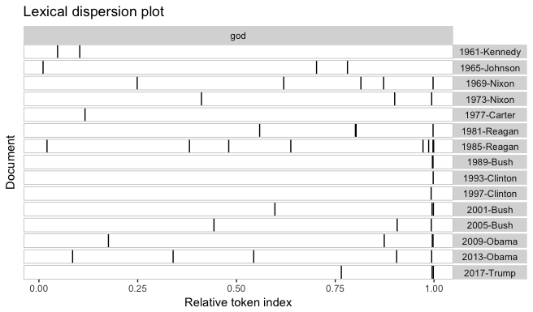

An Overview of quanteda
========================================================
author: Ken Benoit
date: 2017-11-15
autosize: true
css: custom.css
font-family: arial

quantitative text analysis using R
-------------------------------------------


YATAP ??
========================================================
(Why) Yet Another Text Analysis Package?

- **quanteda**: An R package for the quantitative analysis of textual data
- First developed in 2012, ERC funded academic research
- Idea: compete not with other text analysis R packages, but rather with Python's **nltk**
- Provide basic-level complete functionality for NLP, integrated with higher-level analytic tools
- Follow good practice, by being:
    + *R-like*
    + *flexible*, *consistent*, and *fast*
    + *inter-operable* with other packages
    + *reproducible* and *transparent* workflow


R-like
========================================================

```r
summary(data_corpus_irishbudget2010, 5)
## Corpus consisting of 14 documents, showing 5 documents:
## 
##               Text Types Tokens Sentences number   foren    name party
##   Brian_Lenihan_FF  1953   8641       374     01   Brian Lenihan    FF
##  Richard_Bruton_FG  1040   4446       217     02 Richard  Bruton    FG
##    Joan_Burton_LAB  1624   6393       307     03    Joan  Burton   LAB
##   Arthur_Morgan_SF  1595   7107       343     04  Arthur  Morgan    SF
##     Brian_Cowen_FF  1629   6599       250     05   Brian   Cowen    FF
## 
## Source:  /Users/kbenoit/Dropbox (Personal)/GitHub/quanteda/* on x86_64 by kbenoit
## Created: Wed Jun 28 22:04:18 2017
## Notes:
```


```r
ndoc(data_corpus_irishbudget2010)
## [1] 14
(data_dfm_irishbudget2010 <- dfm(data_corpus_irishbudget2010))
## Document-feature matrix of: 14 documents, 5,140 features (81.2% sparse).
nfeature(data_dfm_irishbudget2010)
## [1] 5140
```

R-like (cont.)
========================================================

```r
(toks <- tokens(c(d1 = "Once upon a time.",
                  d2 = "There was a UseR! conference."),
                remove_punct = TRUE))
## tokens from 2 documents.
## d1 :
## [1] "Once" "upon" "a"    "time"
## 
## d2 :
## [1] "There"      "was"        "a"          "UseR"       "conference"

is.tokens(toks)
## [1] TRUE

as.character(toks)
## [1] "Once"       "upon"       "a"          "time"       "There"      "was"        "a"         
## [8] "UseR"       "conference"
```


flexible
========================================================
- different object types work very well together, in an integrated way
- easy to coerce special **quanteda** objects to standard R objects
- all functions can be **piped** using `%>%`

consistent
========================================================
-  very consistent grammar, for functions and inputs and returns
-  very consistent naming scheme
    e.g. `data_corpus_inaugural`, `data_dfm_lbgexample`
-  common approaches across functions

fast
========================================================
- lots of core workhorse functions written in C++
- uses **stringi** for all string handling
- uses sparse matrix operations through **Matrix** package
- many functions exploit the power and speed of **data.table**

compatibility with other packages
========================================================
- conformity to the [Text Interchange Format](https://github.com/ropensci/tif)
- easy to coerce classes to standard R objects
- `corpus()` can be constructed from a **tm** corpus
- import/export methods exist in **tidytext**
- `convert()` will export foreign document-feature matrixes for:
    + **lda** package
    + **tm**'s `DocumentTermMatrix`
    + the `dtm` format of the **topicmodels** package
    + **lsa**'s `textmatrix` package
    + the wonky list used by **stm**, including covariates within the `dfm`


corpus: a repository for texts and associated data
========================================================
- Holds text and all associated data
- Very easy to create: input `character`, `data.frame`, **tm** corpus, or another corpus
- Takes both document variables ("docvars) and corpus meta-data

corpus: example
========================================================

```r
txt <- c(doc1 = "This is my first doc.  Contains two sentences.",
         doc2 = "The second doc is just one sentence.",
         doc3 = "One.  Two.  Three.  Jump!")

corpus(txt)
## Corpus consisting of 3 documents and 0 docvars.

mycorp <- corpus(txt, docvars = data.frame(day = c("a", "a", "b")))
mycorp
## Corpus consisting of 3 documents and 1 docvar.

summary(mycorp)
## Corpus consisting of 3 documents:
## 
##  Text Types Tokens Sentences day
##  doc1     9     10         2   a
##  doc2     8      8         1   a
##  doc3     6      8         4   b
## 
## Source:  /Users/kbenoit/Dropbox (Personal)/GitHub/QTAUR-halfday/overview/* on x86_64 by kbenoit
## Created: Tue Nov 14 16:37:58 2017
## Notes:
```

corpus functions
========================================================
| name              | function                                    |
|-------------------|-------------------------------------------- |
| `corpus`          | construct a corpus                          |
| `corpus_reshape`	| recast the document units of a corpus       |
| `corpus_sample`	| randomly sample documents from a corpus     |
| `corpus_segment`	| segment texts into component elements       |
| `corpus_subset`	| extract a subset of a corpus                |
| `corpus_trim`	    | remove sentences based on their token lengths or a pattern match |


character functions
========================================================
| name           | function                                    |
|----------------|-------------------------------------------- |
| `char_tolower`   | convert the case of character objects |
| `char_toupper`   | convert the case of character objects |
| `char_trim`	     | remove sentences based on their token lengths or a pattern match |
| `char_wordstem`	 | stem the terms in an object |

tokens
========================================================

Very flexible options, e.g.

```r
tokens(x, remove_punct = TRUE, remove_numbers = TRUE)
```


| option            | default |
| ------------------|---------|
| `remove_numbers`    | `FALSE` |
| `remove_punct`      | `FALSE` |
| `remove_symbols`    | `FALSE` |
| `remove_separators` | `TRUE`  |
| `remove_twitter`    | `FALSE` |
| `remove_hyphens`    | `FALSE` |
| `remove_url`    | `FALSE` |

Options also exist to create ngrams and skipgrams.

tokens functions
========================================================
| name           | function                                    |
| ---------------|-------------------------------------------- |
| `tokens`	     | tokenize a set of texts |
| `tokens_compound` |	convert token sequences into compound tokens |
| `tokens_lookup` |	apply a dictionary to a tokens object |
| `tokens_ngrams` |	create ngrams and skipgrams from tokens |
| `tokens_remove` |	select or remove tokens from a tokens object |
| `tokens_select` |	select or remove tokens from a tokens object |
| `tokens_skipgrams` |	create ngrams and skipgrams from tokens |
| `tokens_tolower` |	convert the case of tokens |
| `tokens_toupper` |	convert the case of tokens |
| `tokens_wordstem` |	stem the terms in an object |


document-feature matrix (dfm)
========================================================
| name            | function                                    |
| --------------- |-------------------------------------------- |
| `dfm`           |	create a document-feature matrix            |
| `dfm_compress`  |	recombine a dfm by identical dimension elements |
| `dfm_group`     |	recombine a dfm by grouping on a variable   |
| `dfm_lookup`    |	apply a dictionary to a dfm |
| `dfm_remove`    |	select features from a dfm or fcm |
| `dfm_sample`    |	randomly sample documents or features
| `dfm_select`    |	select features from a dfm or fcm
| `dfm_smooth`    |	weight the feature frequencies in a dfm
| `dfm_sort`      |	sort a dfm by frequency of the margins
| `dfm_tolower`   |	convert the case of the features of a dfm and combine
| `dfm_toupper`   |	convert the case of the features of a dfm and combine
| `dfm_trim`      |	trim a dfm using frequency threshold-based feature selection
| `dfm_weight`    |	weight a dfm, including full SMART scheme, *tf-idf*, etc. in a dfm
| `dfm_wordstem`  | stem the features in a dfm |


feature co-occurrence matrix (fcm)
========================================================
name            | function                                    
--------------- |-------------------------------------------- 
`fcm`	| create a feature co-occurrence matrix 
`fcm_compress`	| 	recombine an fcm by identical dimension elements
`fcm_remove`	| 	select features from an fcm
`fcm_select`	| 	select features from an fcm
`fcm_sort`	| 	sort an fcm in alphabetical order of the features
`fcm_tolower`	| 	convert the case of the features of an fcm and combine
`fcm_toupper`	| 	convert the case of the features of an fcm and combine`

feature-feature matrix (fcm)
========================================================

```r
fcm(c("the cat in the hat ate eggs", "the cat ate a hat"),
    window = 3, weights = 3:1)
## Feature co-occurrence matrix of: 7 by 7 features.
## 7 x 7 sparse Matrix of class "fcm"
##         features
## features the cat in hat ate eggs a
##     the    1   3  2   3   3    2 1
##     cat    0   0  1   2   2    1 1
##     in     0   0  0   1   1    1 0
##     hat    0   0  0   0   2    1 1
##     ate    0   0  0   0   0    1 1
##     eggs   0   0  0   0   0    0 0
##     a      0   0  0   0   0    0 0
```

textmodel
========================================================
name               | function
-------------------|-----------------
`textmodel_ca` |	correspondence analysis of a document-feature matrix
`textmodel_nb` |	Naive Bayes (multinomial, Bernoulli) classifier for texts
`textmodel_wordfish` | Slapin and Proksch (2008) text scaling model
`textmodel_wordscores` |	Laver, Benoit and Garry (2003) text scaling
`textmodel_wordshoal`	| Lauderdale and Herzog (2017) text scaling model
`textmodel_affinity`	| (coming soon) Perry and Benoit (2017) class affinity scaling
`coef.textmodel` | extract coefficients from a `textmodel`

textmodel example
========================================================

```r
data(data_corpus_movies, package = "quantedaData")
summary(data_corpus_movies, 10)
## Corpus consisting of 2000 documents, showing 10 documents:
## 
##             Text Types Tokens Sentences Sentiment   id1   id2
##  neg_cv000_29416   354    841         9       neg cv000 29416
##  neg_cv001_19502   156    278         1       neg cv001 19502
##  neg_cv002_17424   276    553         3       neg cv002 17424
##  neg_cv003_12683   314    564         2       neg cv003 12683
##  neg_cv004_12641   380    842         2       neg cv004 12641
##  neg_cv005_29357   328    749         1       neg cv005 29357
##  neg_cv006_17022   331    643         5       neg cv006 17022
##   neg_cv007_4992   325    676         6       neg cv007  4992
##  neg_cv008_29326   441    797        10       neg cv008 29326
##  neg_cv009_29417   401    965        23       neg cv009 29417
## 
## Source:  /Users/kbenoit/Dropbox/QUANTESS/quantedaData_kenlocal_gh/* on x86_64 by kbenoit
## Created: Sat Nov 15 18:43:25 2014
## Notes:
```

textmodel example (cont.)
========================================================

```r
data_corpus_movies_train <- 
    corpus_subset(data_corpus_movies, Sentiment == "pos") %>%
    corpus_sample(size = 500) +
    corpus_subset(data_corpus_movies, Sentiment == "neg") %>%
    corpus_sample(size = 500)
data_corpus_movies_train
## Corpus consisting of 1,000 documents and 3 docvars.
```

textmodel example (cont.)
========================================================

```r
traindfm <- dfm(data_corpus_movies_train, remove_punct = TRUE, 
                remove = stopwords("english"), verbose = TRUE)
nbmod <- textmodel_nb(traindfm, y = docvars(data_corpus_movies_train, "Sentiment"))

testdfm <- dfm(data_corpus_movies, verbose = TRUE) %>%
  dfm_select(pattern = traindfm, verbose = TRUE)
```

textmodel example (cont.)
========================================================

```r
nbpred <- predict(nbmod, newdata = testdfm)
print(nbpred, 10)
## Predicted textmodel of type: Naive Bayes
## (showing 10 of documents)
## 
##                      lp(pos)     lp(neg)    Pr(pos) Pr(neg) Predicted
## neg_cv000_29416  -2801.23500  -2776.7045     0.0000  1.0000       neg
## neg_cv001_19502  -1101.89268  -1067.7391     0.0000  1.0000       neg
## neg_cv002_17424  -2213.82593  -2156.5382     0.0000  1.0000       neg
## neg_cv003_12683  -2529.70144  -2480.2907     0.0000  1.0000       neg
## neg_cv004_12641  -3114.67547  -3107.4130     0.0007  0.9993       neg
## neg_cv005_29357  -3088.44885  -3037.5888     0.0000  1.0000       neg
## neg_cv006_17022  -2547.71231  -2517.1513     0.0000  1.0000       neg
## neg_cv007_4992   -2708.19999  -2638.9410     0.0000  1.0000       neg
## neg_cv008_29326  -3467.22503  -3505.9988     1.0000  0.0000       pos
## neg_cv009_29417  -3297.26793  -3243.1226     0.0000  1.0000       neg

table(nbpred$nb.predicted, docvars(data_corpus_movies, "Sentiment"))
##      
##       neg pos
##   neg 913 121
##   pos  87 879
```


textstat
========================================================

name               | function
-------------------|-----------------
`textstat_collocations` |	calculate collocation statistics
`textstat_dist` |	distance computation between documents or features
`textstat_keyness` |	calculate keyness statistics
`textstat_lexdiv` |	calculate lexical diversity
`textstat_readability` |	calculate readability
`textstat_simil` |	similarity computation between documents or features

textplot
========================================================
name               | function
-------------------|-----------------
`textplot_scale1d` |	plot a fitted scaling model
`textplot_wordcloud` |	plot features as a wordcloud
`textplot_xray` |	plot the dispersion of key word(s)
`textplot_keyness` | plot association of words with target v. reference set


kwic
========================================================
Key words in context - great exploratory tool:

```r
kwic(data_corpus_inaugural, "terror*", 3)
##                                                                                         
##     [1797-Adams, 1325]             violence, by |  terror   | , intrigue,               
##  [1933-Roosevelt, 112] unreasoning, unjustified |  terror   | which paralyzes needed    
##  [1941-Roosevelt, 287]          by a fatalistic |  terror   | , we proved               
##    [1961-Kennedy, 866]     uncertain balance of |  terror   | that stays the            
##    [1961-Kennedy, 990]           instead of its |  terrors  | . Together let            
##     [1981-Reagan, 813]       Americans from the |  terror   | of runaway living         
##    [1981-Reagan, 2196]       those who practice | terrorism | and prey upon             
##   [1997-Clinton, 1055]        the fanaticism of |  terror   | . And they                
##   [1997-Clinton, 1655]   strong defense against |  terror   | and destruction.          
##     [2009-Obama, 1632]         aims by inducing |  terror   | and slaughtering innocents
##     [2017-Trump, 1117]  against radical Islamic | terrorism | , which we
```

kwic (cont.)
========================================================
Can plot word occurrence as an "x-ray" plot:

```r
godkwic <- kwic(corpus_subset(data_corpus_inaugural, Year > 1960), "god", 3)
head(godkwic)
##                                                                  
##    [1961-Kennedy, 74] you and Almighty | God | the same solemn   
##   [1961-Kennedy, 162]      the hand of | God | . We dare         
##    [1965-Johnson, 18]   you and before | God | is not mine       
##  [1965-Johnson, 1210]  no promise from | God | that our greatness
##  [1965-Johnson, 1345]  the judgment of | God | is harshest on    
##     [1969-Nixon, 606]   concern, thank | God | , only material
```

```r
textplot_xray(godkwic, scale = "relative")
```


kwic (cont.)
========================================================


nfunctions
========================================================
name               | function
-------------------|-----------------
`ndoc` |	count the number of documents or features
`nfeature` |	count the number of documents or features
`nscrabble` |	count the Scrabble letter values of text
`nsentence` |	count the number of sentences
`nsyllable` |	count syllables in a text
`ntoken` |	count the number of tokens or types
`ntype` |	count the number of tokens or types

nfunctions (cont)
========================================================


```r
nscrabble("quioxtic")
## [1] 26
```

functions for dictionary analysis
========================================================

```r
mydict1 <- dictionary(file = "~/Dropbox/QUANTESS/dictionaries/LIWC/LIWC2001_English.dic")
mydict2 <- as.dictionary(subset(tidytext::sentiments, lexicon == "nrc"))

mydfm <- dfm(data_corpus_inaugural)

dictdfm1 <- dfm_lookup(mydfm, dictionary = mydict1)
head(dictdfm1)
## Document-feature matrix of: 6 documents, 6 features (8.33% sparse).
## 6 x 6 sparse Matrix of class "dfm"
##                  features
## docs              Pronoun  I We Self You Other
##   1789-Washington     107 57  3   60  14    18
##   1793-Washington      13  9  0    9   1     0
##   1797-Adams          141 34 14   48   1    37
##   1801-Jefferson      144 34 44   78  14    31
##   1805-Jefferson      213 37 46   83   8    85
##   1809-Madison         75 32 14   46   0    17

dictdfm2 <- dfm_lookup(mydfm, dictionary = mydict2)
head(dictdfm2)
## Document-feature matrix of: 6 documents, 6 features (0% sparse).
## 6 x 6 sparse Matrix of class "dfm"
##                  features
## docs              anger anticipation disgust fear joy negative
##   1789-Washington     9           49       6   25  46       42
##   1793-Washington     2            3       1    4   5        4
##   1797-Adams         29           82      21   52  90       86
##   1801-Jefferson     31           55      14   56  70       65
##   1805-Jefferson     24           78      18   41  70       70
##   1809-Madison       19           50       6   27  53       49
```


companion packages
========================================================
* **readtext** for importing text files


```r
rt <- readtext::readtext("~/Dropbox/QUANTESS/corpora/UDHR/*.pdf",
                         docvarsfrom = "filenames")
rt
## readtext object consisting of 13 documents and 2 docvars.
## # data.frame [13 x 4]
##              doc_id                          text docvar1  docvar2
##               <chr>                         <chr>   <chr>    <chr>
## 1  UDHR_chinese.pdf "\"世界人权宣言\n联合国\"..."    UDHR  chinese
## 2    UDHR_czech.pdf           "\"VŠEOBECNÁ \"..."    UDHR    czech
## 3   UDHR_danish.pdf           "\"Den 10. de\"..."    UDHR   danish
## 4  UDHR_english.pdf           "\"Universal \"..."    UDHR  english
## 5   UDHR_french.pdf           "\"Déclaratio\"..."    UDHR   french
## 6 UDHR_georgian.pdf           "\"      FLFV\"..."    UDHR georgian
## # ... with 7 more rows
corpus(rt)
## Corpus consisting of 13 documents and 3 docvars.
```

companion packages
========================================================
* **spacyr** for tagging parts of speech, parsing dependencies

```r
library(spacyr)
spacy_initialize()

sp <- spacy_parse("President Trump tweeted again this morning about North Korea.")

entity_consolidate(sp)
##   doc_id sentence_id token_id        token        lemma    pos entity_type
## 1  text1           1        1    President    president  PROPN            
## 2  text1           1        2        Trump        trump ENTITY      PERSON
## 3  text1           1        3      tweeted        tweet   VERB            
## 4  text1           1        4        again        again    ADV            
## 5  text1           1        5 this_morning this_morning ENTITY        TIME
## 6  text1           1        6        about        about    ADP            
## 7  text1           1        7  North_Korea  north_korea ENTITY         GPE
## 8  text1           1        8            .            .  PUNCT
```


where to go for more
====================
* http://quanteda.io, with additional tutorials

* [GitHub page](http://github.com/kbenoit/quanteda)

* [Demonstration with Chinese language](https://github.com/ropensci/textworkshop17/tree/master/demos/chineseDemo)

* [Demonstration with Japanese language](http://github.com/ropensci/textworkshop17/tree/master/demos/japaneseDemo)

* Twitter [@kenbenoit](http://twitter.com/kenbenoit); Kohei's blog https://koheiw.net

